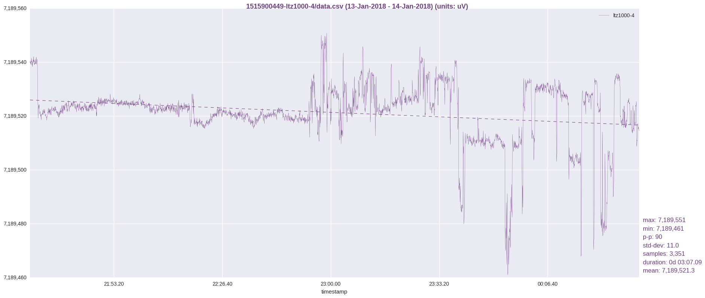

just a quick spot-check of LTZ1000 #4 while stepping out to grab some groceries.

LTZ1000 #4 is on the CSI1802X supply at 15V.

Edit: wow, while watching the log via ssh, just getting up and walking out of
the room shifted the output from ~540 to ~523 uV (near the beginning of the log).
I started the log while sitting in a chair just in front of the LTZ, ssh'ed in
from my laptop, then got up and walked out of the room.

commentary:

the initial part of the graph (near ~7.189,540) was when I was sitting in front
of the ltz with laptop in-hand.

the drop after represents moving to another room.

the very slight rise and quiet portion (just before the 21:53:20 mark) I believe
represents leaving my apartment for the grocery store.

my receipt shows that I checked out from the grocery store at 10:44pm.  in that case.
I probably didn't leave my apartment until the drop just before 22:26:40.

the wildly noisy remainder of the graph coinicides with setting up and testing a PID
temperature controller in direct vicinity to the LTZ (with a 10A switching power supply).

