note: there are no timestamps in this data.  each data point ison a 0.25 second interval, and the temperature set-point increases by 1 degree Celsius every minute.

## run 1, kp: 2.0, ki: 1.0, kd: 0.5

first recorded run.  oops, I had forgot to turn the peltier fan on.

input:

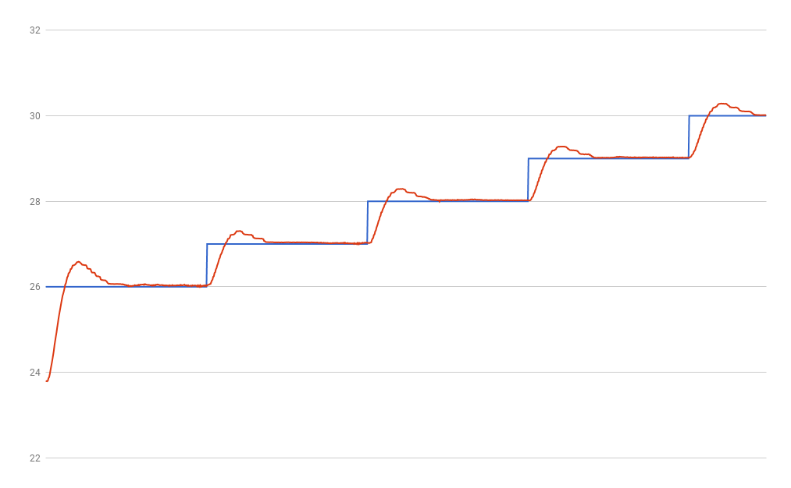

output:

## run 2, kp: 2.0, ki: 1.0, kd: 0.5

I rearranged the connections to give AREF better filtering.

input:

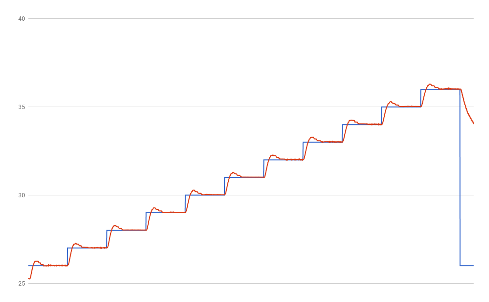

output:

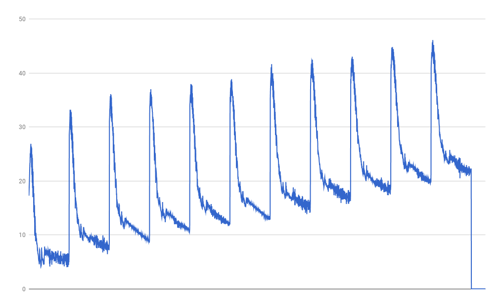

## run 3, kp: 2.0, ki: 2.0, kd: 0.5

increase ki from 1.0 to 2.0

input:

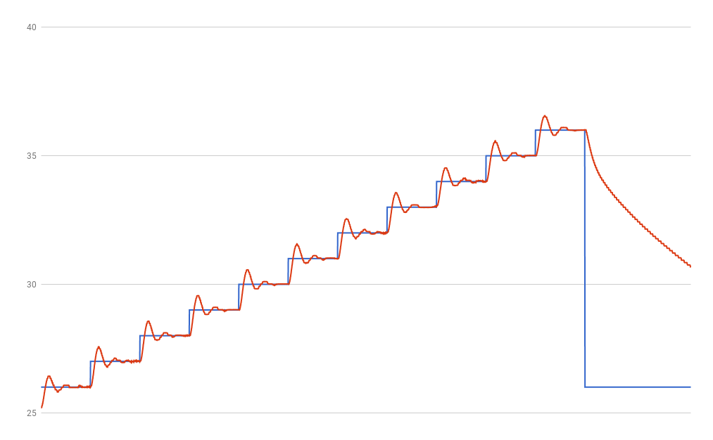

output:

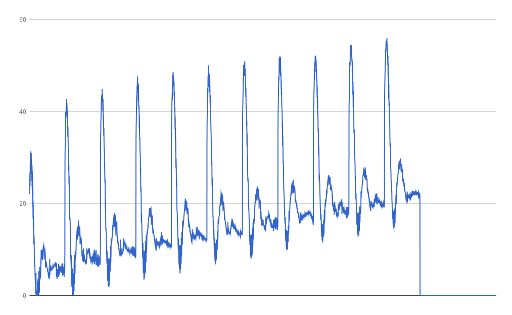

## run 4, kp: 2.0, ki: 0.5, kd: 0.5

decreased ki from 2.0 to 0.5

input:

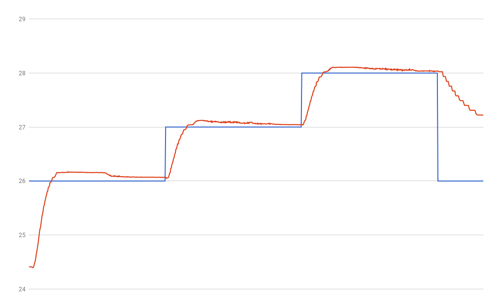

output:

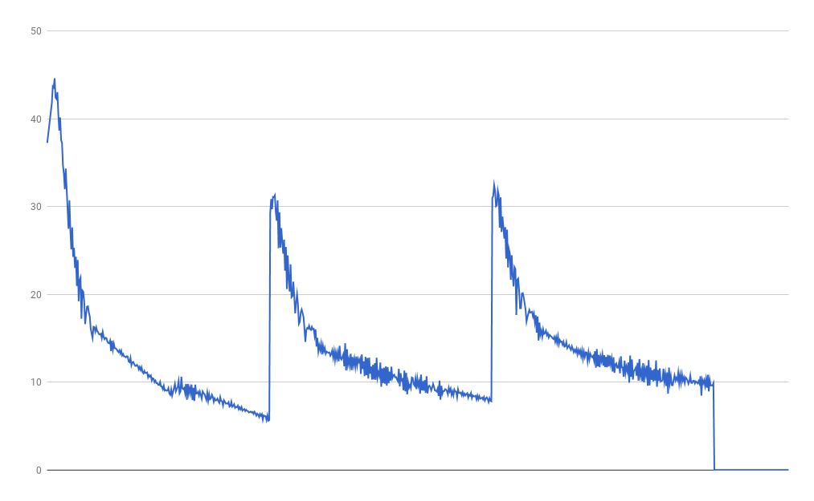

## run 5, kp: 3.0, ki: 0.0, kd: 0.0

just using kp (3.0).

input:

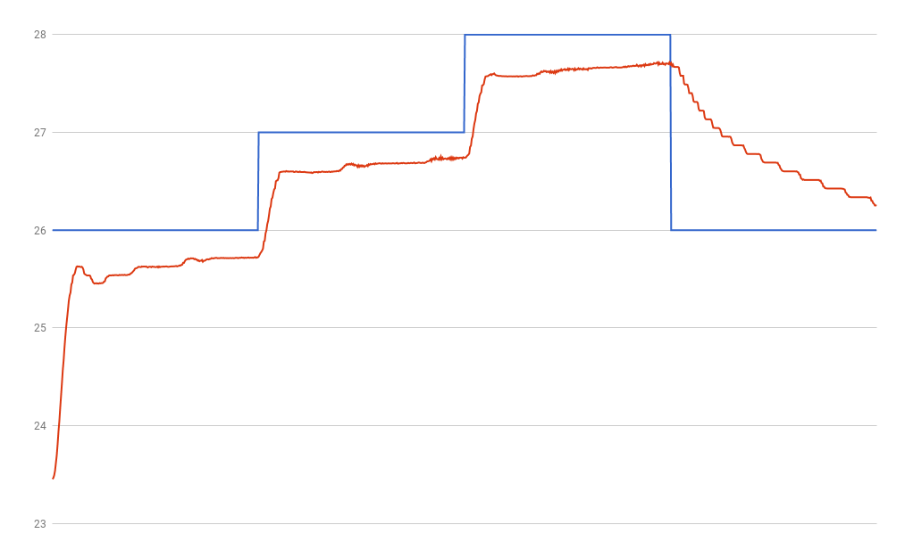

output:

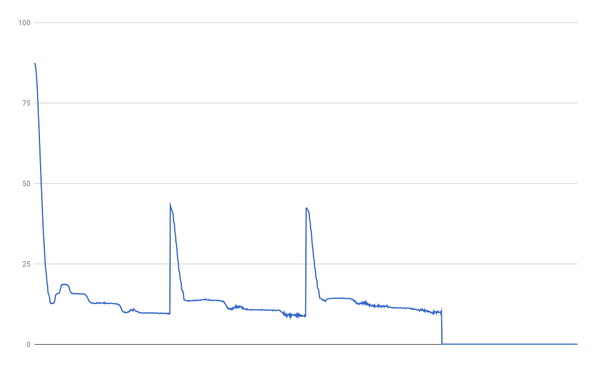

## run 6, kp: 4.0, ki: 0.0, kd: 0.0

bumping kp to 4.0.

input:

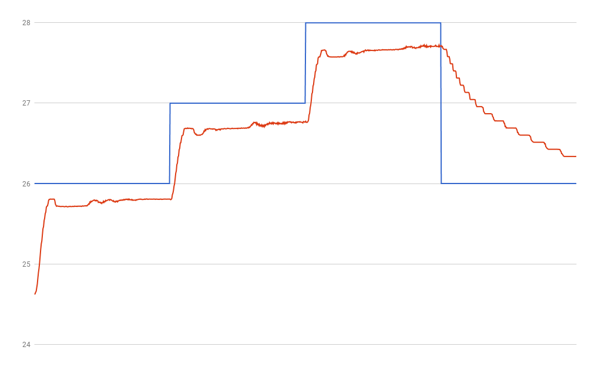

output:

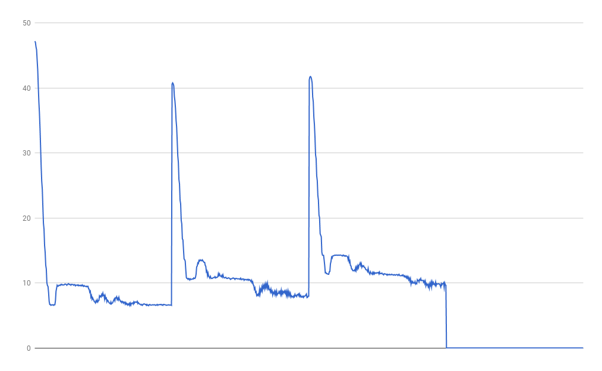

