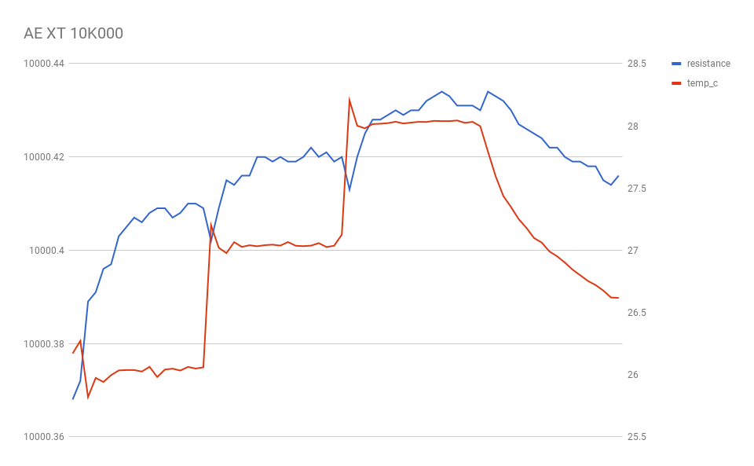
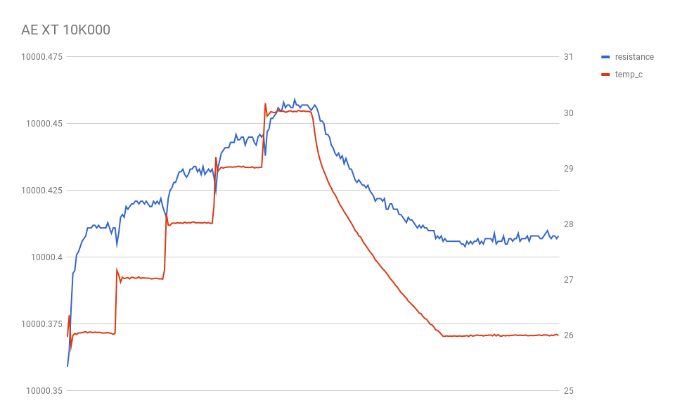
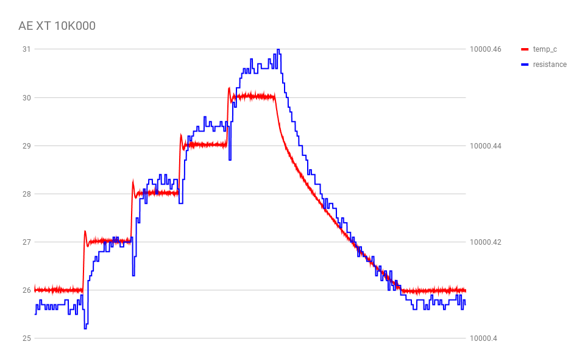
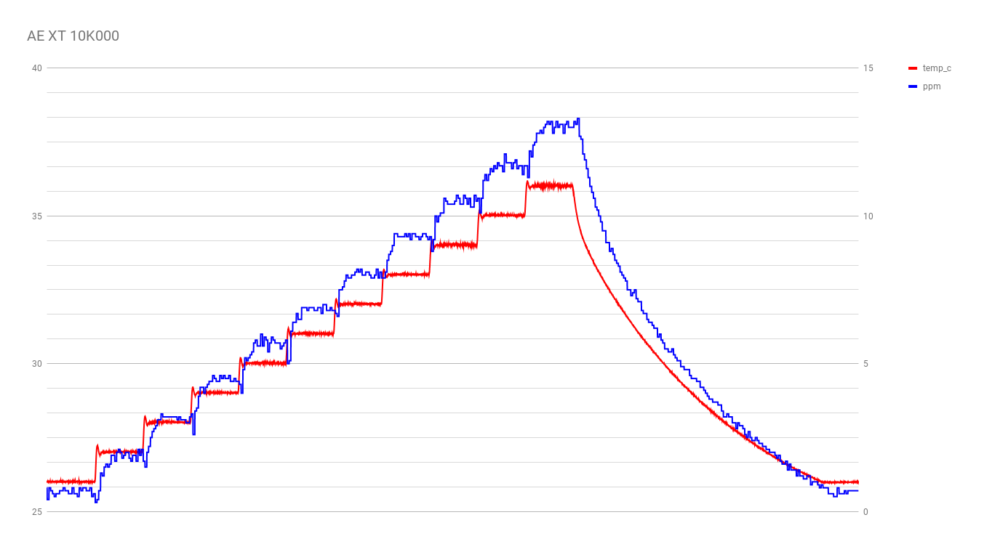

these initial tests were done using an AE XT 10K000 metal foil resistor purchased from ebay seller juliakingking.

## run 1

initial test run, working out the kinks.

## run 2

another test run.  workin on it.

## run 3

another test run.  90 second intervals.

still getting some sort of strange giant dip right when the chart starts.  there are also smaller dips each time the controller spikes in current (to jump to the next temperature).

## run 4

trying a different sample interleaving strategy: currently the HP 34401A spits out one sample every 1.7 seconds, whereas the temperature controller spits out samples every 1/4 second.  this time, I'll repeat the last seen 34401A sample in order to capture all of the temperature controller samples.

additionally, I'll try running at 26 degrees for a run-in period silently, to avoid the large abberation at the start of the graph.

## run 5

trying a more extended run (26C to 36C), and reworking graph to show ppm deviation instead of raw resistance value.

OK!  Finally a decent looking result.  It looks like the resistor deviated about 12ppm over 10C, so room-temperature tempco is about 1.2ppm/K.

