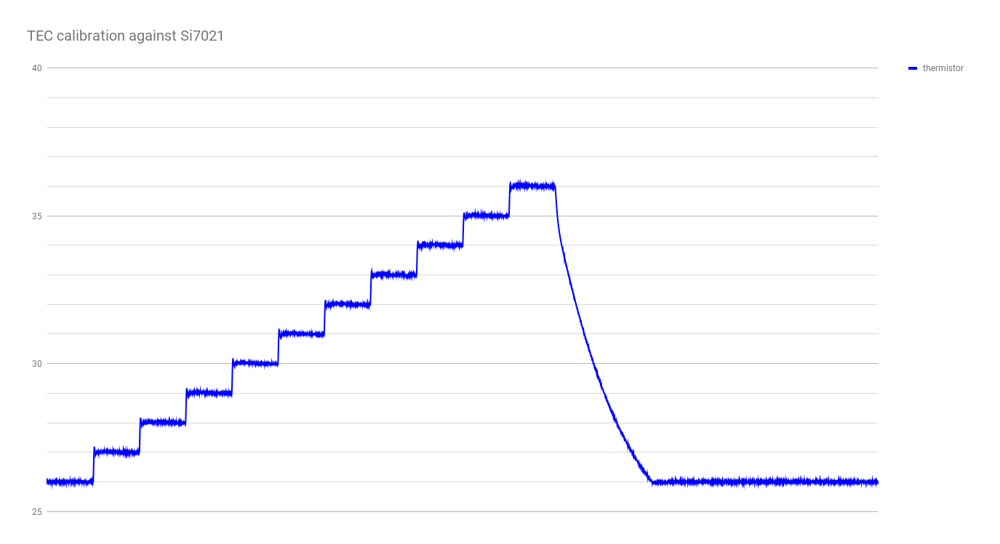
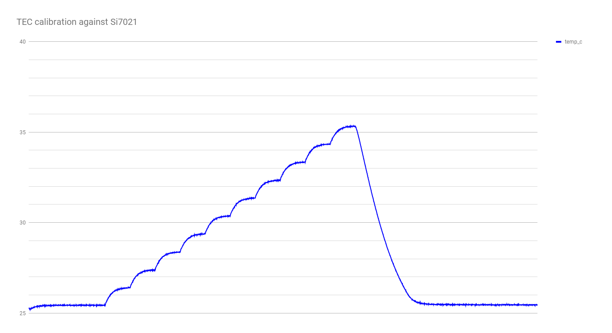

## run 1

initial run.  90 seconds per C step.

looks like I need to up the interval to longer than 90 seconds.

## run 2

second run, 180 seconds per C step.

probably should have gone with 300 seconds per step just to be safe.

