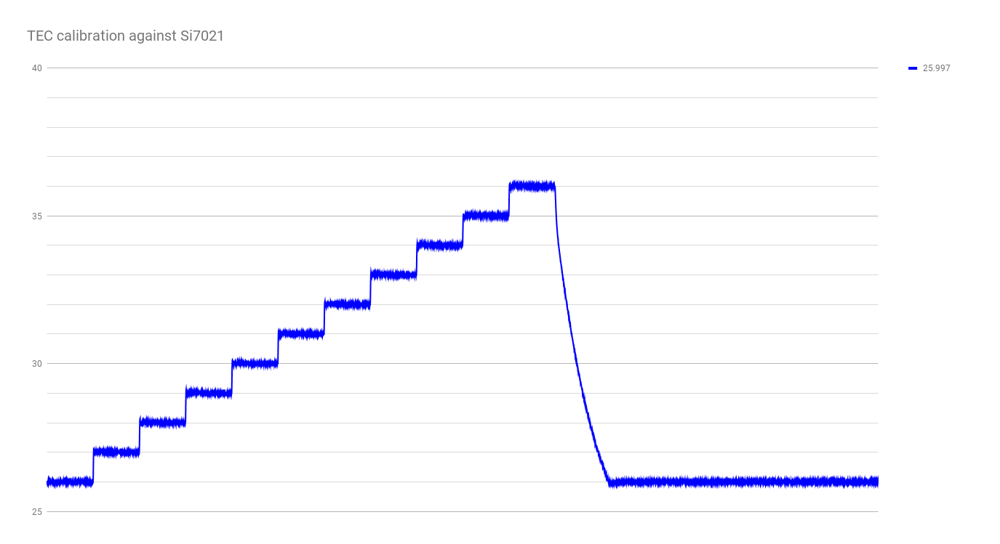

## run 1

initial run.  90 seconds per C step.


looks like I need to up the interval to longer than 90 seconds.

## run 2

second run, 180 seconds per C step.


probably should have gone with 300 seconds per step just to be safe.

## run 3

for reference, here's what I'm running:

```
cd run3
../../plotting-scripts/Si7021-logger.py /dev/tty.usbmodem1411 | tee env.csv
```

```
../../plotting-scripts/trivial-serial.py /dev/tty.usbmodem1421 | tee controller.csv
```

bumping to 5 minutes per C, adding a 0.6C offset.




ok, that's close enough for now.
