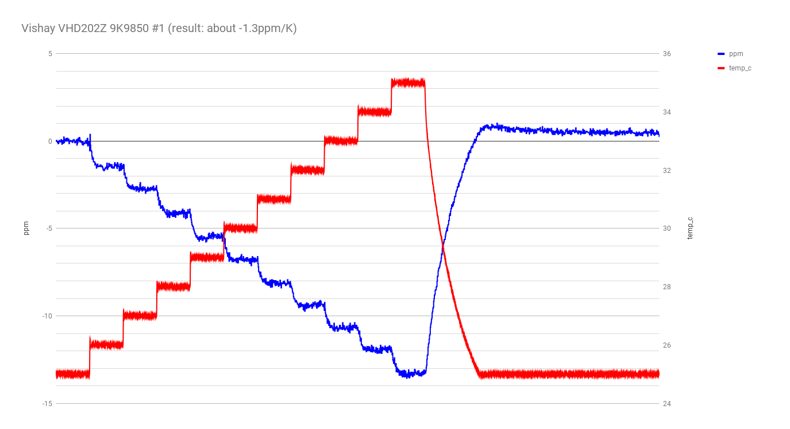
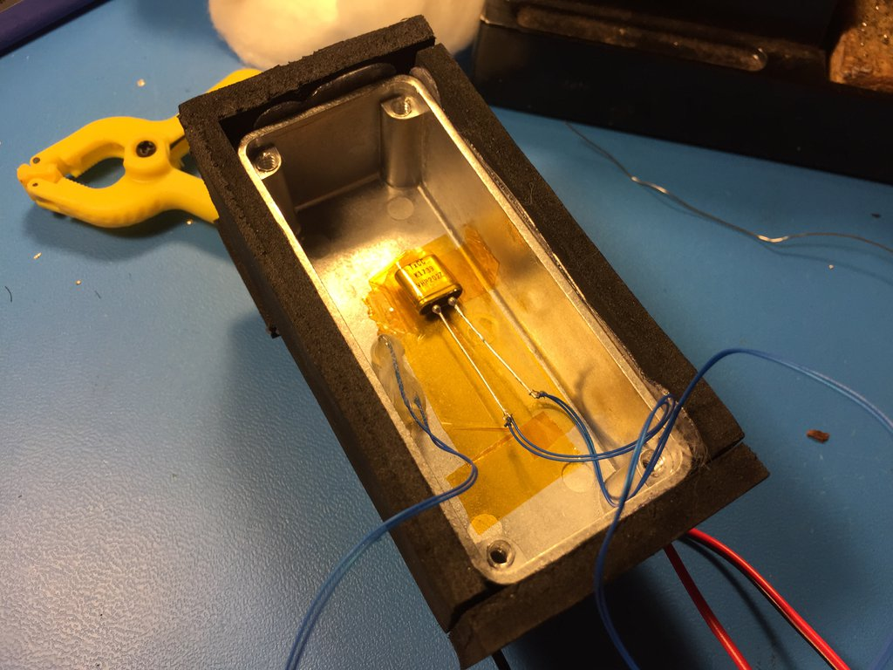
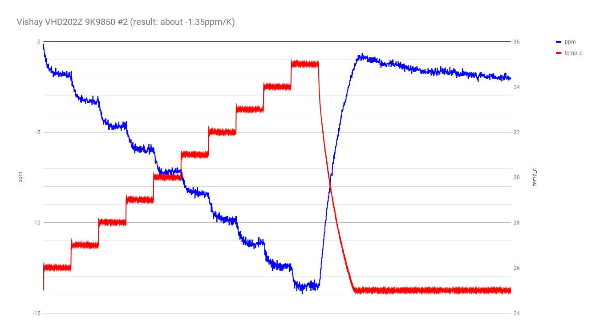
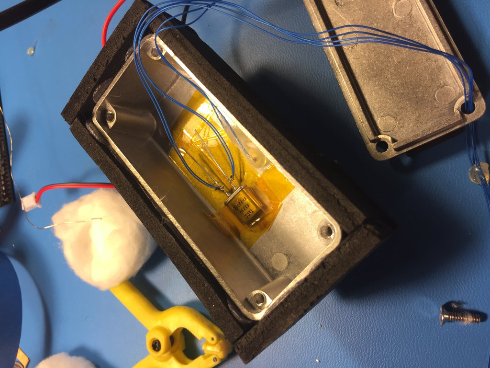

logging some Vishay VHD202Z hermetically sealed Z-foil resistors.

## run 1: 9K9850 #1

10 steps of 1C, 5 minutes per step.

-1.3ppm/K?  Are you kidding me?  This is disappointing to say the least.  So much for 0.2ppm/C.  http://www.vishaypg.com/docs/63120/hzseries.pdf

## run 2: 9K9850 #1, with maximum possible lead length

Let's see what the effect of lead length is on the tempco.

no apparent difference.

## run 3: 9K9850 #2

Bummer, this one is just as bad: -1.35ppm/K.

Looks like I made a mistake and truncated the lead-in data.  The chart starts at the jump from 25C to 26C.

## run 4: 9K9850 #3

testing the third 9K9850.  this was a quick run (2 minutes per C).  I want to get through the rest of these resistors quickly to see if they are all ~1.3ppm/K.

