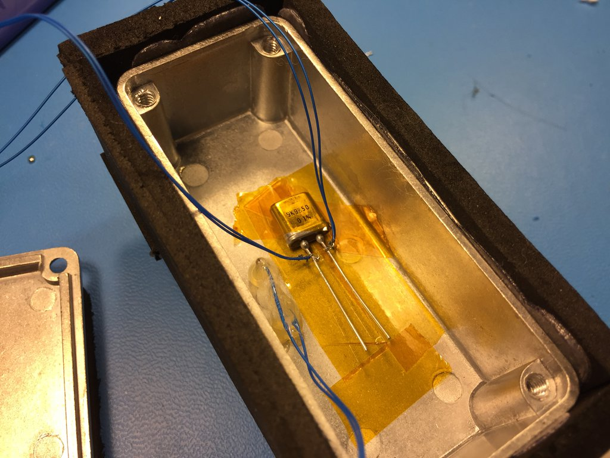

logging some Vishay VHD202Z hermetically sealed Z-foil resistors.

## run 1: 9K9850 #1

10 steps of 1C, 5 minutes per step.

-1.3ppm/K?  Are you kidding me?  This is disappointing to say the least.  So much for 0.2ppm/C.  http://www.vishaypg.com/docs/63120/hzseries.pdf
