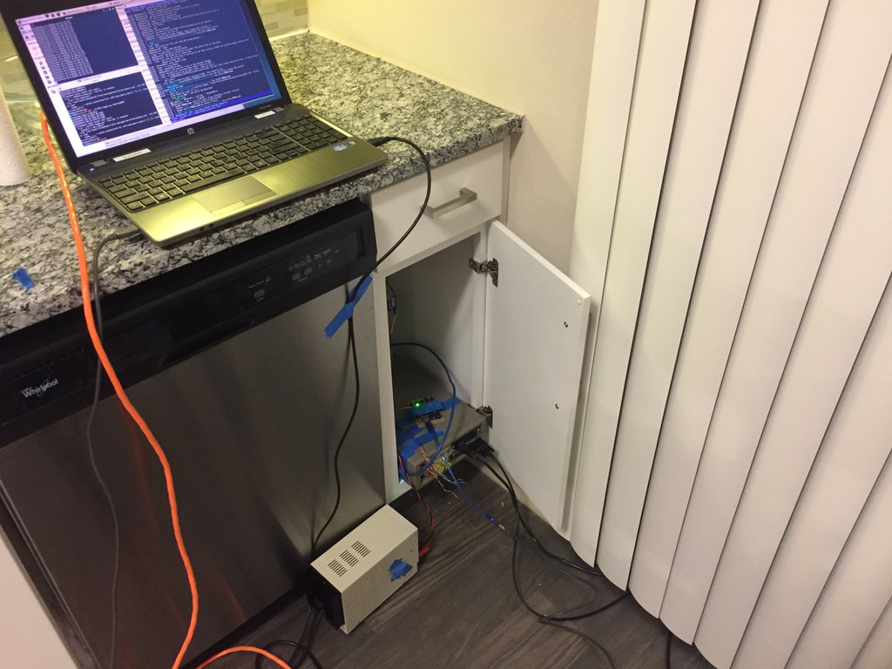
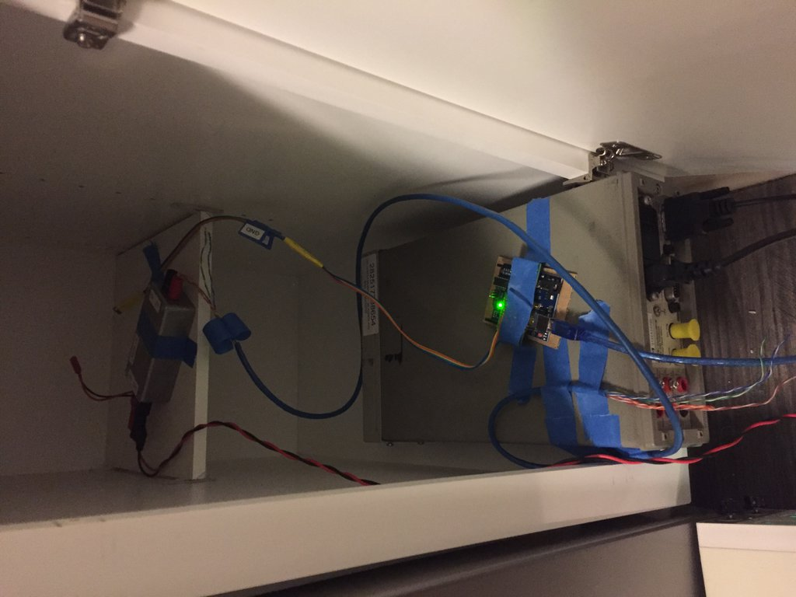
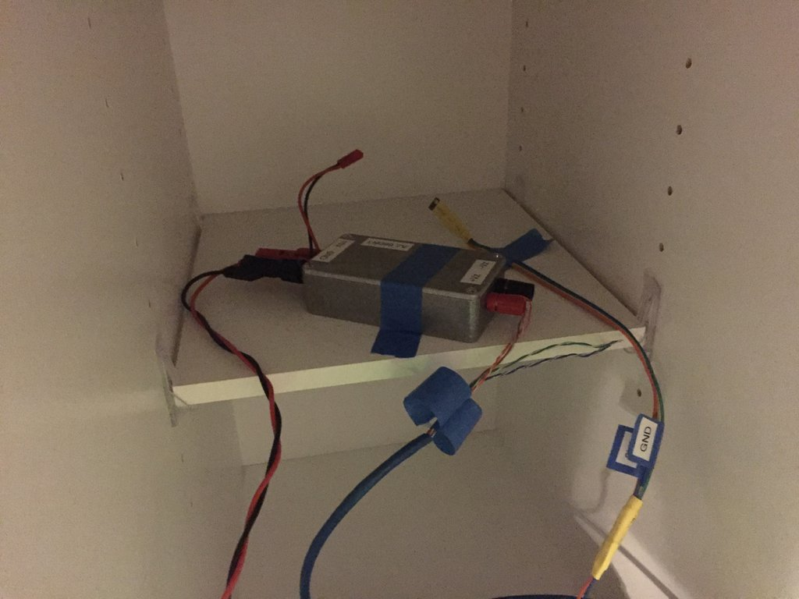
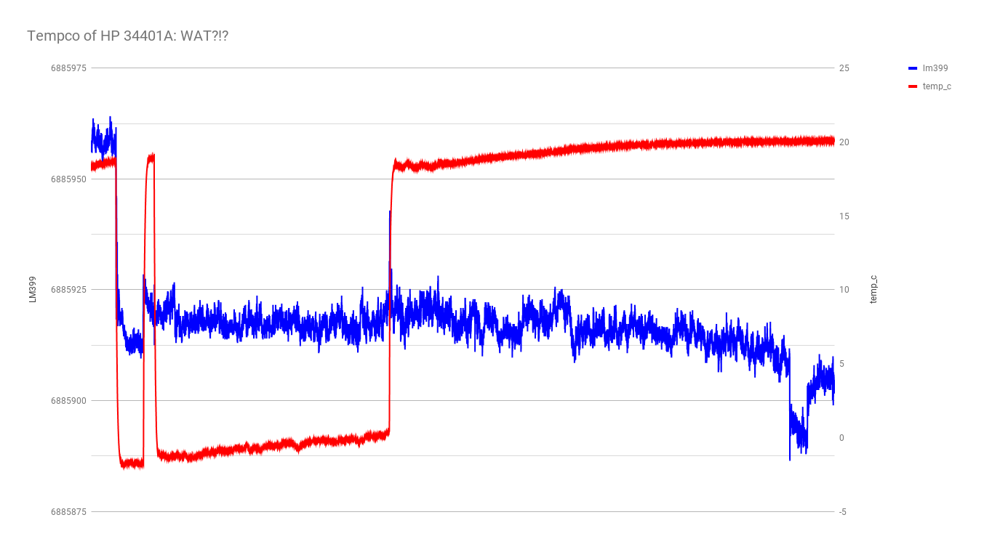
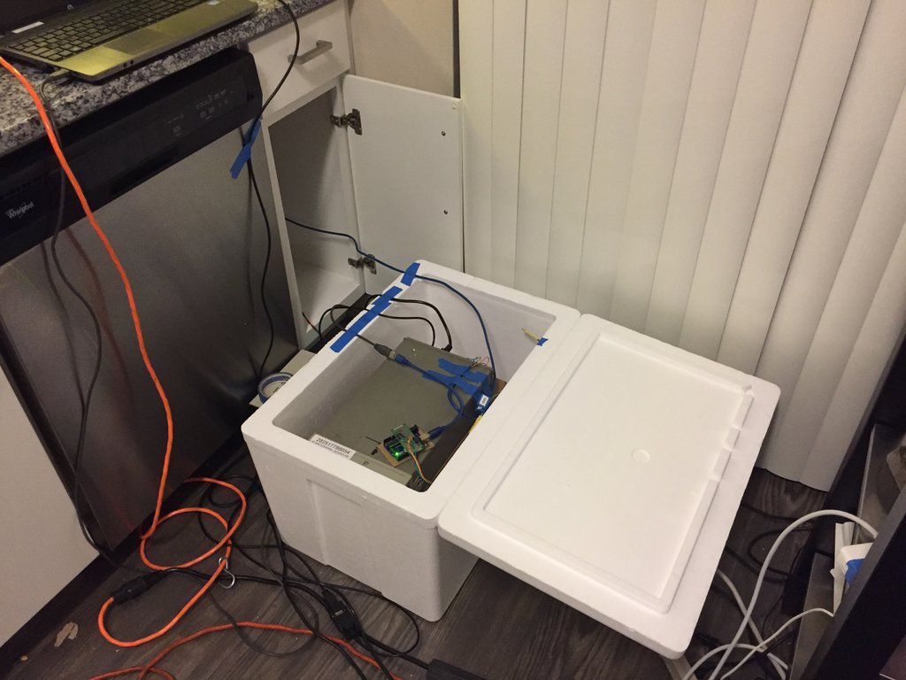
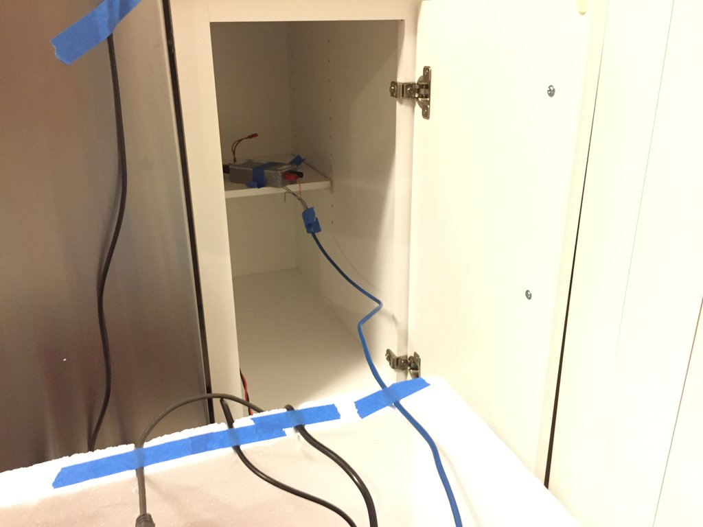
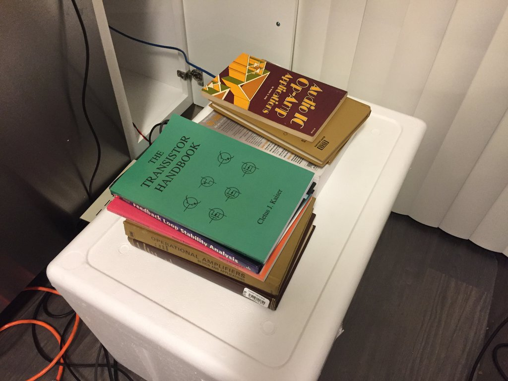

Attempting to measure the tempco of my HP 34401A.

## part 1: into the fridge

I have an LM399 board (sitting at room temp) connected to the HP, which started at room temp and was then put into my refrigerator, then removed again.

An Si7021 was used to log temperature, and stayed with the HP 34401A.  Room temperature was assumed to stay relatively constant.

Results are bit strange looking:

## part 2: outside in freezing wheather

later the same evening, I decided to take advantage of the fact that it was freezing outside on my balcony.

I kept the LM399 inside, then placed the meter outside on the balcony, feeding the wires through the small crack of a slightly ajar sliding glass door.

I left the meter out overnight, briefly brought just the temperature sensor back inside to verify the indoor temperature was stable, then put the temp sensor back outside.  In the morning, I moved the meter back inside, and let it run all day while at work.

It appears I have caused a hysteretic shift downwards.

## part 3: into an insulated box

I picked up a styrofoam chest on the way home from work today, with the idea of placing the meter inside and allowing to heat up its own environment.

