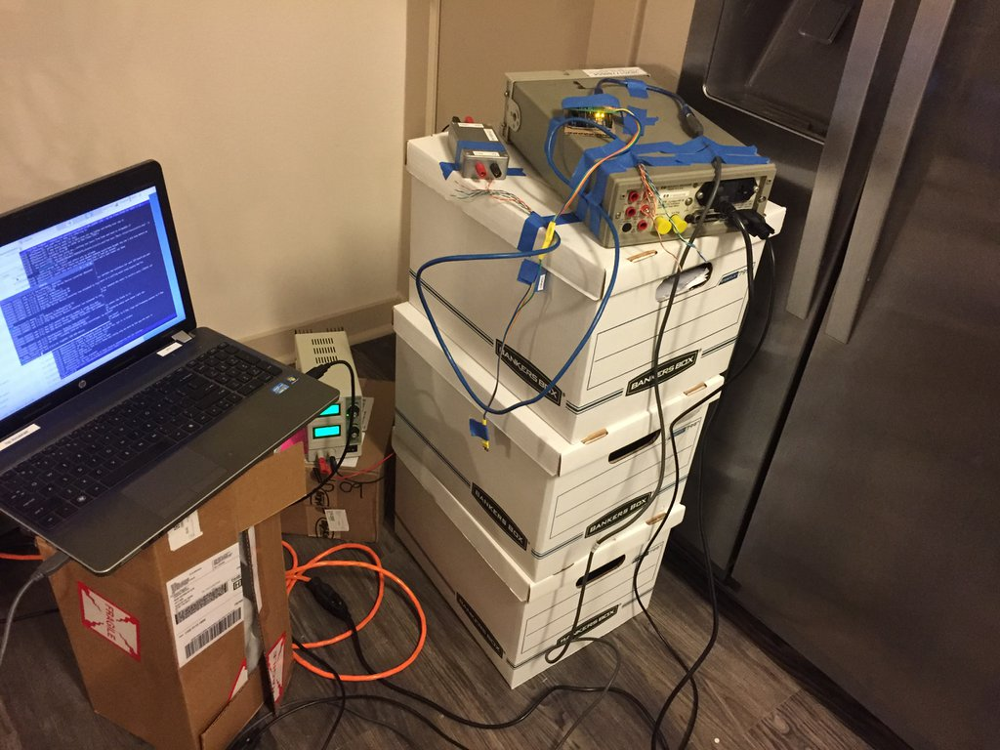
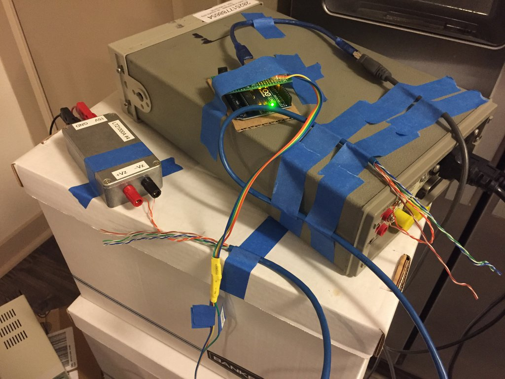
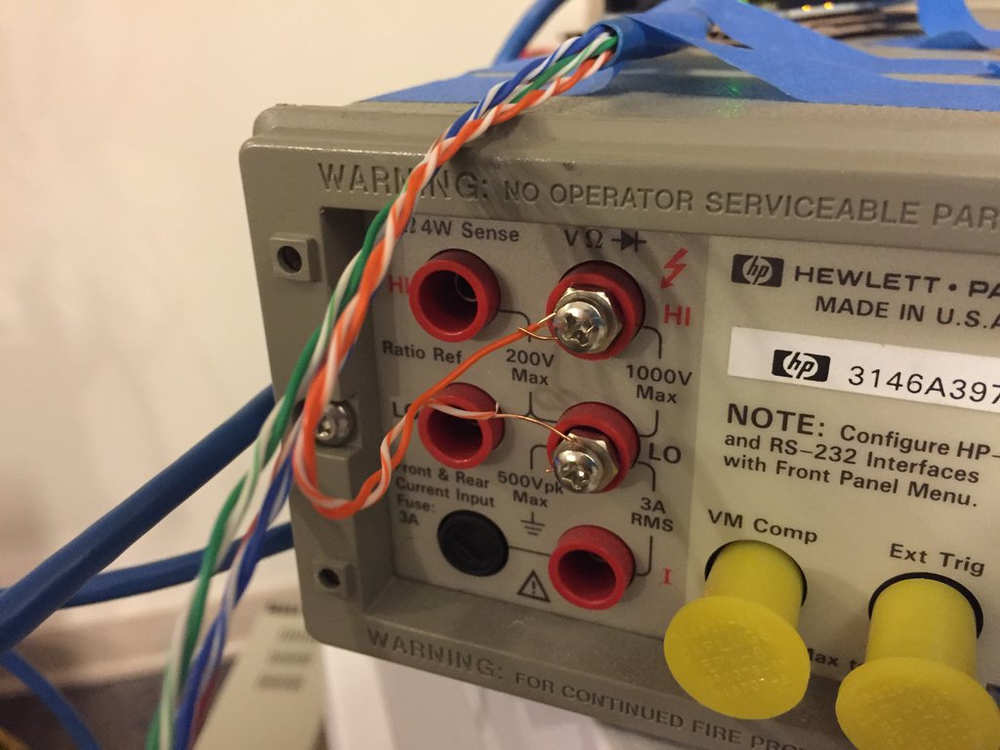
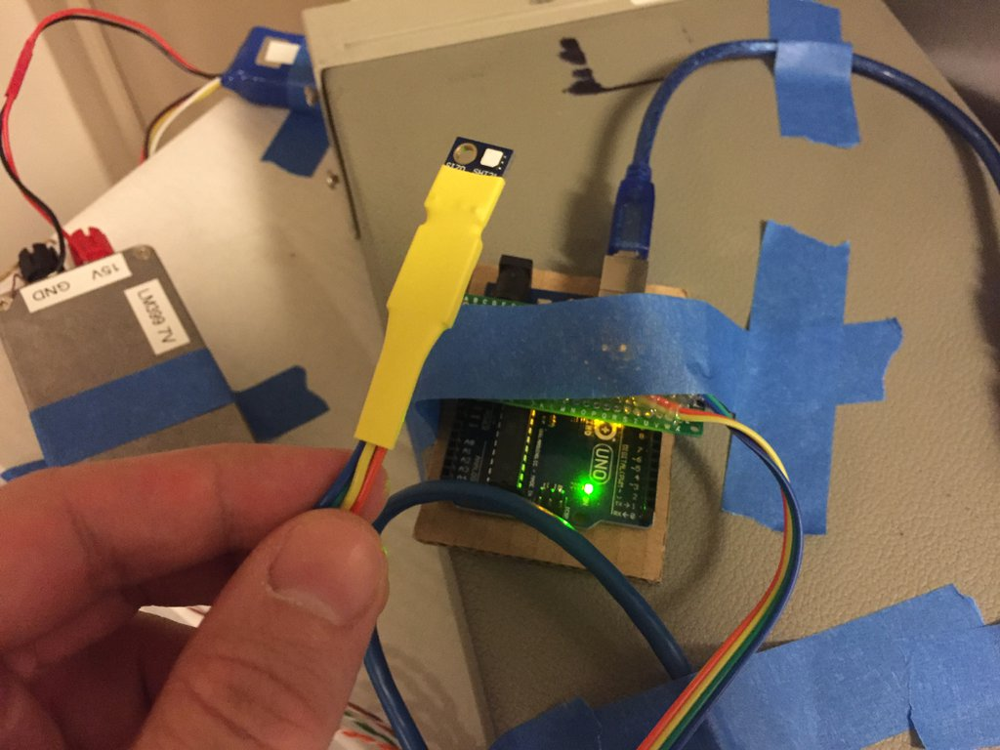
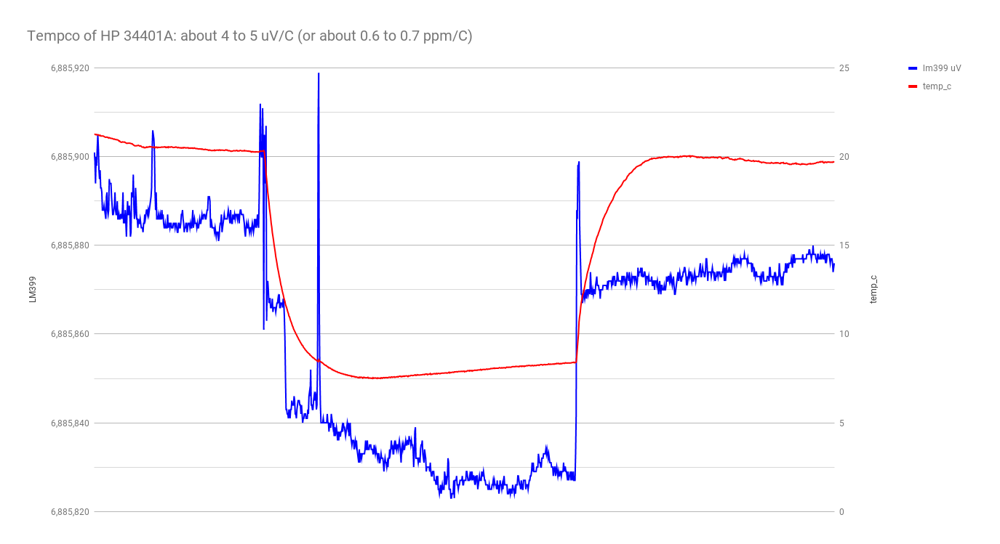
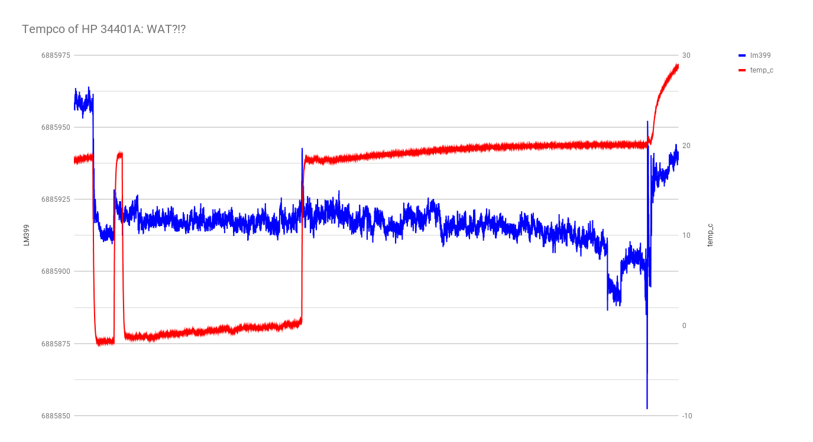
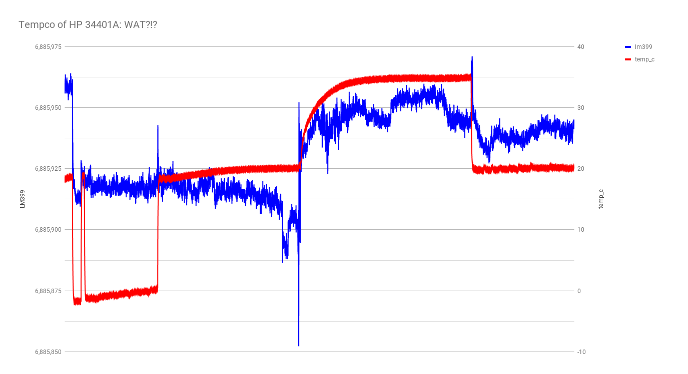

Attempting to measure the tempco of my HP 34401A.

## part 1: into the fridge

I have an LM399 board (sitting at room temp) connected to the HP, which started at room temp and was then put into my refrigerator, then removed again.

An Si7021 was used to log temperature, and stayed with the HP 34401A.  Room temperature was assumed to stay relatively constant.

The LM399 was powered from a 3S lipo battery, fully charged to 12.6V at the start of the run, which discharged to 12.2V by the end of the run.

Connections: LM399 to Pomona 3770 binding posts to CAT 5 cable to [Cinch 108-0753-102 banana jacks](https://www.digikey.com/product-detail/en/cinch-connectivity-solutions-johnson/108-0753-102/J10108-ND/565813).

Results are bit strange looking:

## part 2: outside in freezing wheather

later the same evening, I decided to take advantage of the fact that it was freezing outside on my balcony.

I kept the LM399 inside, then placed the meter outside on the balcony, feeding the wires through the small crack of a slightly ajar sliding glass door.

This time, the LM399 was powered by a CSI1802X linear supply set to 15V.

I left the meter out overnight, briefly brought just the temperature sensor back inside to verify the indoor temperature was stable, then put the temp sensor back outside.  In the morning, I moved the meter back inside, and let it run all day while at work.

It appears I have caused a hysteretic shift downwards.

Hmm, I just noticed an 80uV jump between the end of the previous experiment and the beginning of this one.  Was that entire difference due to the 12V lipo vs 15V linear supply?

## part 3: into an insulated box

I picked up a styrofoam chest on the way home from work today, with the idea of placing the meter inside and allowing to heat up its own environment.

again, there was an immediate jump, which I can't believe is actually the tempco of the meter.  I believe that simply moving the meter around is causing the jumps, and the much slower adjustments after those jumps are the actual tempco of the meter.