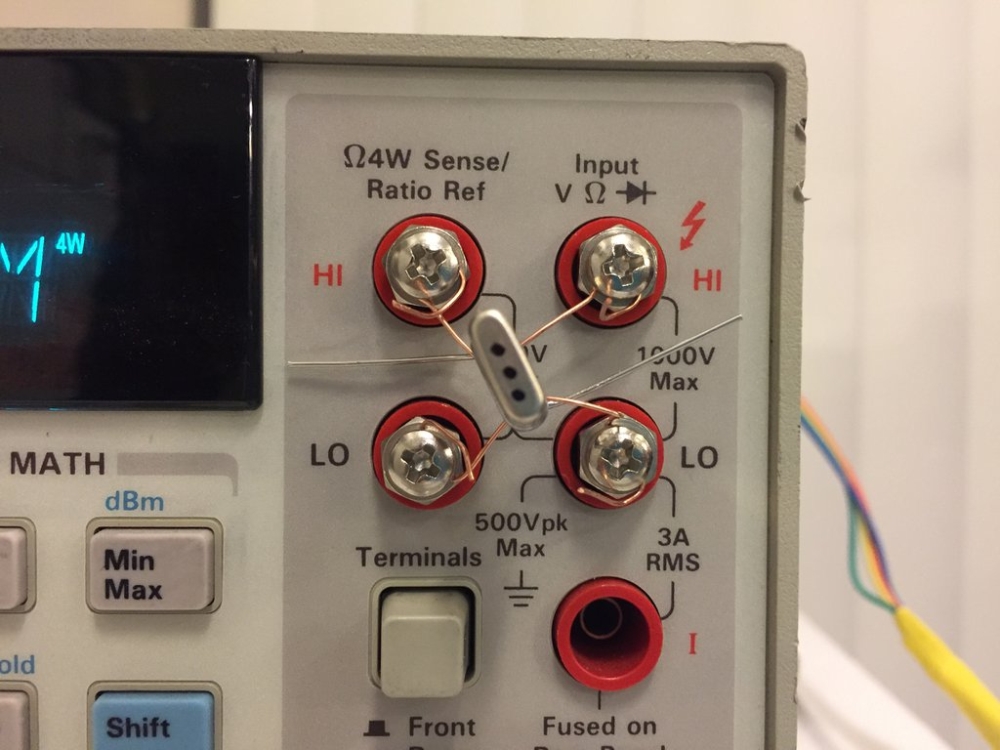
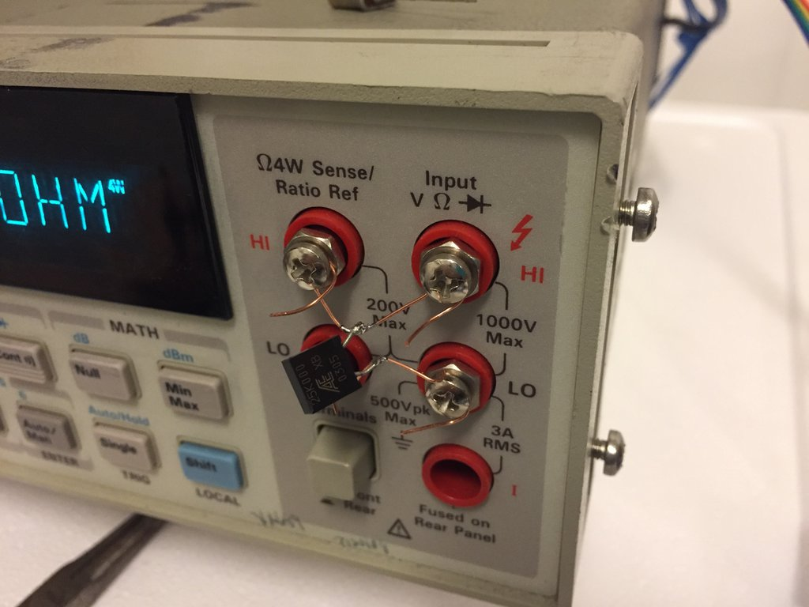
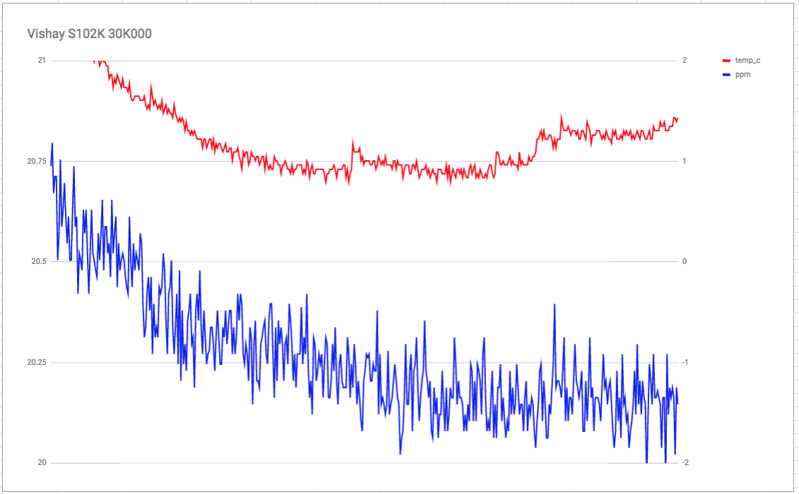
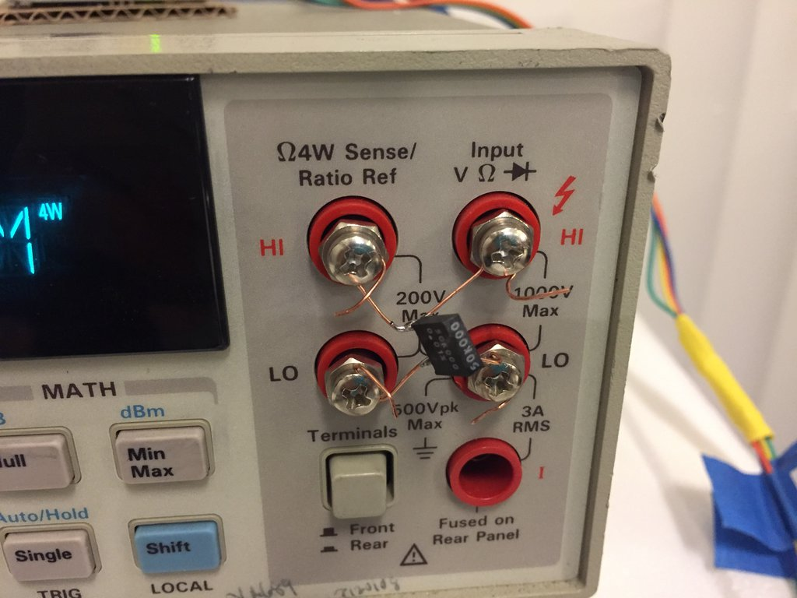
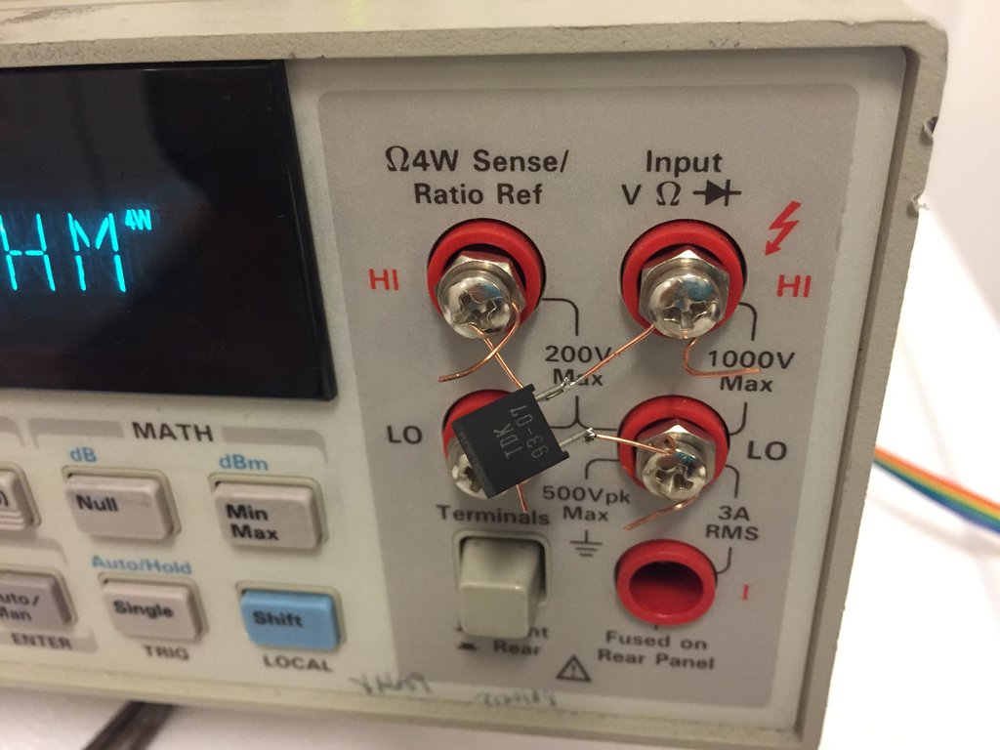
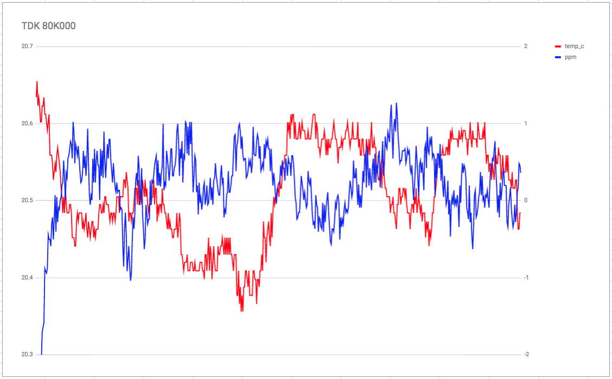
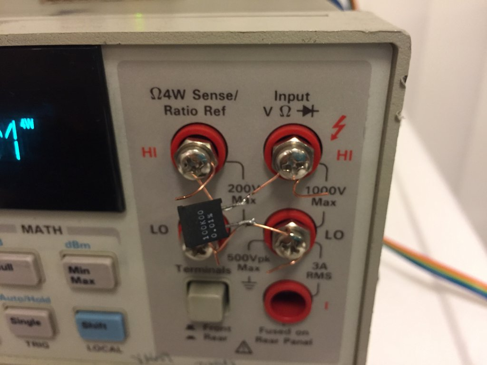
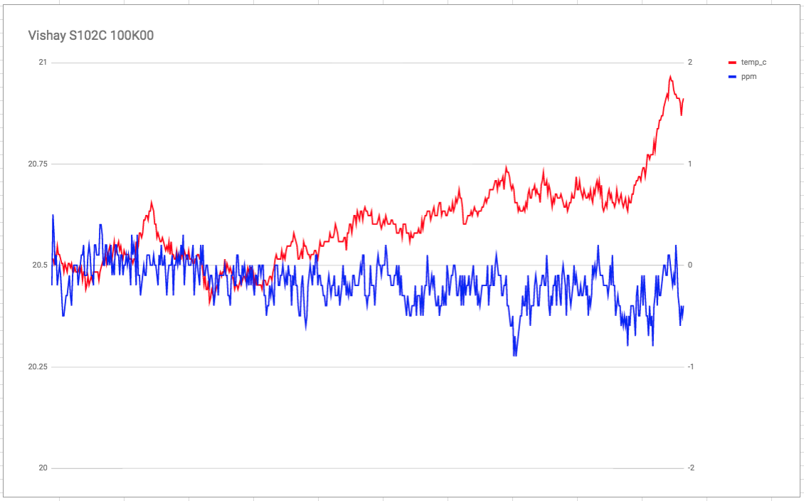
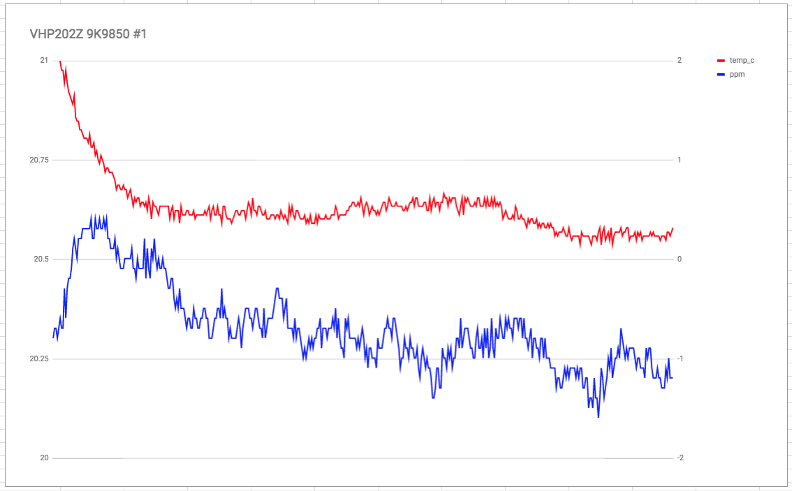

While using my tempco-evaluation rig (see http://www.eevblog.com/forum/projects/mini-tempco-characterization-rig/msg1402458/#msg1402458), noticed that I had excellent results with a 10k resistor, and very "noisy" results with a 20k resistor.

I have since realized that the issue was that I am graphing / measuring ppm, which scales with the resistor.  I.e., if a 20k is only 1/5th of a 100k, the "signal" needs to be scaled up by 5x to fit into the same ppm scale.  However, this also means we are scaling up the drift/noise of the meter by 5x.

As a result, I can accurately measure the tempco of a resistor which is near the top of my meter's resistance range (e.g., 9.9k, 99k, etc), but my rig does a poor job of measuring the tempco of resistors near the bottom of my meter's range (e.g. 1.1k, 11k, etc).

I'll make sure I keep the ppm scale the same across all of these charts (+2ppm to -2ppm) to illustrate the trend.

## run 1: 19k970 #3

testing VHP202Z 19K970 #3, soldered using very short 4-wire leads. 

connectors are [Cinch 108-0753-102](https://www.digikey.com/product-detail/en/cinch-connectivity-solutions-johnson/108-0753-102/J10108-ND/565813).  wire is 24 AWG cat 5, stripped.

here we see the noisy ppm result I was expecting.

## run 2: 9k9850 #1

(see below)

## run 3: AE XB 25K000

this sits at 25% of the ADC's range, so we expect the ppm noise to be slightly better than the 19K970.

## run 4: Vishay S102K 30K000

this sits at 30% of the ADC's range, so ppm's should be veeeery slightly less noisy than the 25k.

## run 5: Vishay VSRJ 50K000

50% of the ADC's range, yadda yadda yadda...

## run 6: TDK 80K000

I started cooking dinner here, and the equipment is currently in the kitchen, so the temperature is a little drifty here.

## run 7: S102C 100K000

we expect this result to be very good, because it is near the top of the ADC's range.

## finally, back where we started the other day: run 2: 9k9850 #1

we expect this result to be very good, because it is near the top of the ADC's range.

edit: redoing some of the charts for consistent ppm and temperature scale.