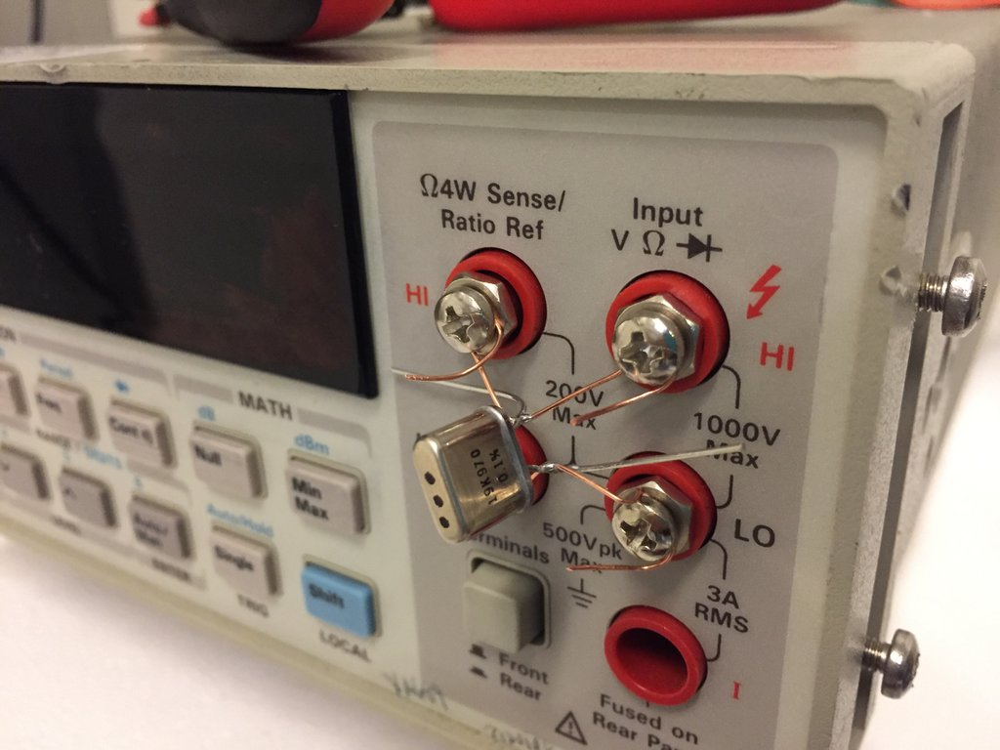

To evaluate the performance of my meter, I'll just log a VHP202Z for several hours.  My suspicion is that the "noise" issue I'm seeing is simply due to the fact that a 20k resistor only occupies the bottom 20% of the ADC's range, so when that signal gets scaled up in a graph, the resulting tempco looks very "noisy".

## run 1

testing VHP202Z 19K980 #3, soldered using very short 4-wire leads. 

connectors are [Cinch 108-0753-102](https://www.digikey.com/product-detail/en/cinch-connectivity-solutions-johnson/108-0753-102/J10108-ND/565813).  wire is 24 AWG cat 5, stripped.

