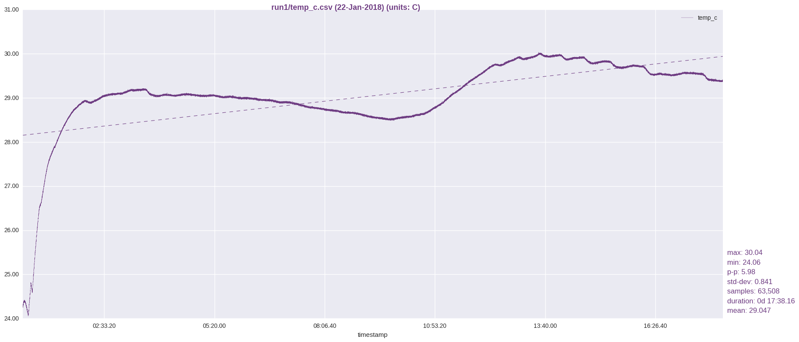

This was an unregulated max-power run to see what the temperature ceiling of the unit was.  unfortunately I did not log the ambient temperature as well, but if I recall, my thermostat was near 70F.

