This was a project to develop a thermal chamber which can maintain a constant temperature environment (of 25C).

## Enclosure

The chamber is a Hammond 1590BB diecast aluminum case.  Twelve 10-Ohm resistors have been affixed to the underside with thermal epoxy.  The chamber has been insulated with 1/4-inch "craft foam".

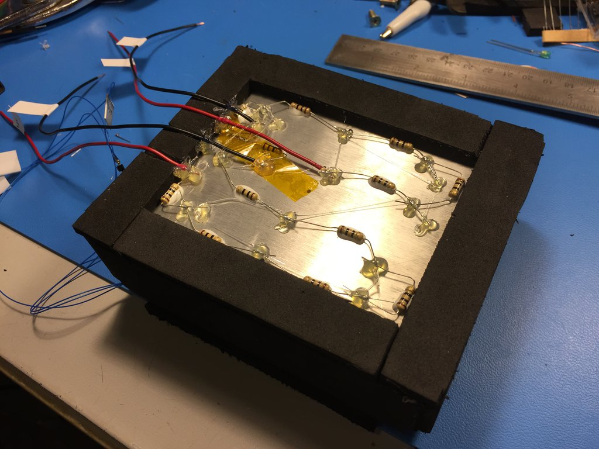

## Initial proof-of-concept board

This was a very rough "first draft" to see if the circuit would work at all.

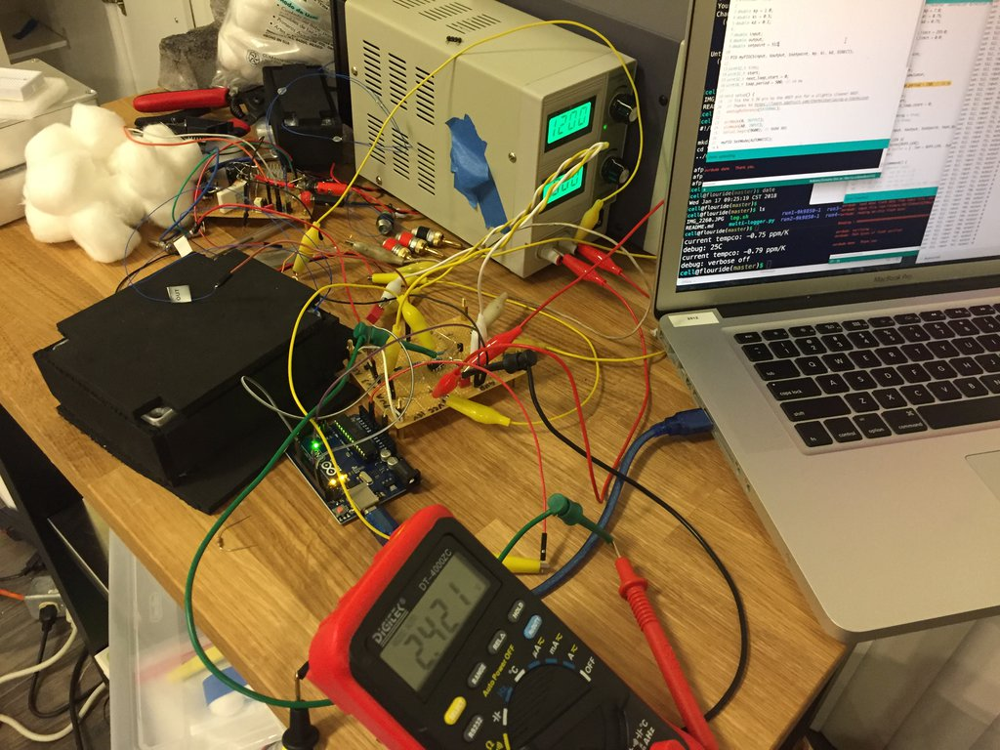

It was pretty noisy, but the concept appeared sound.  I decided to implement a second draft on an Arduino "prototype" shield:

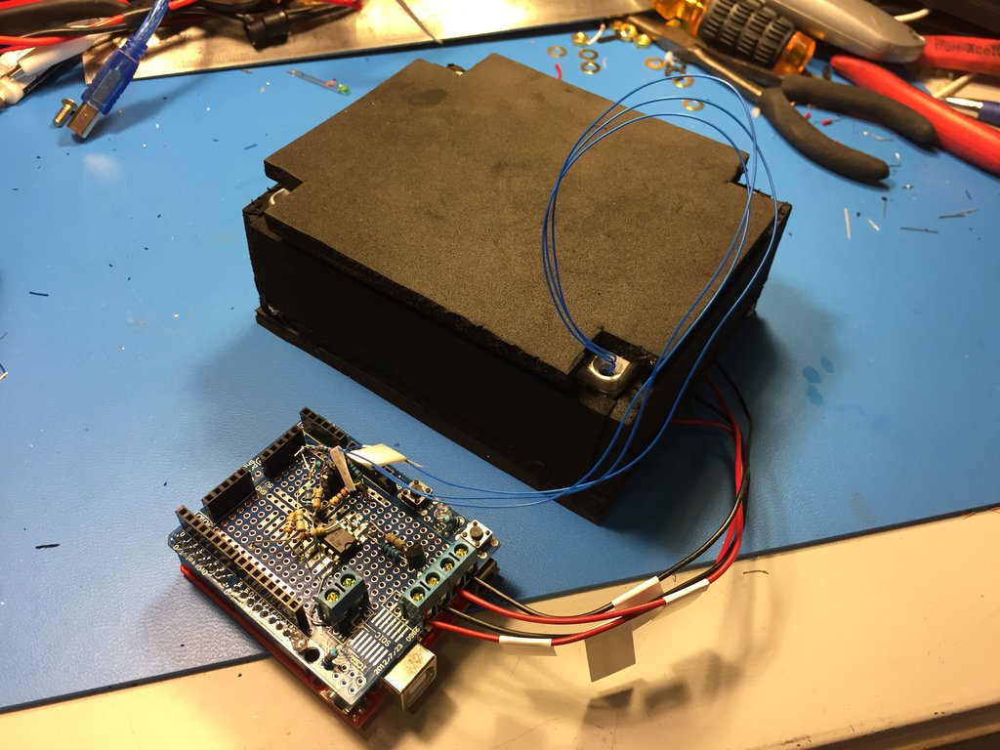

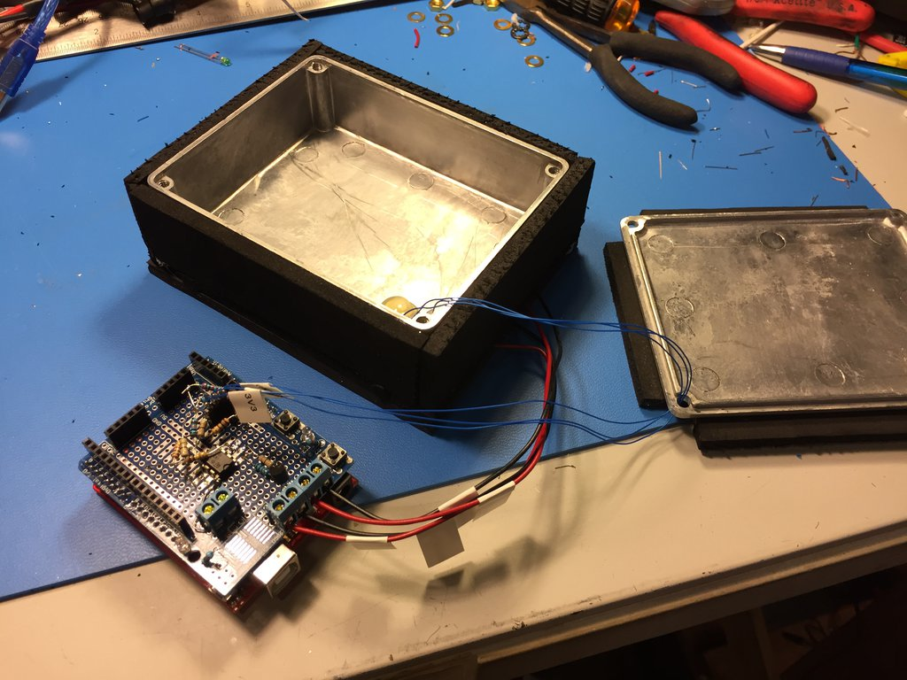

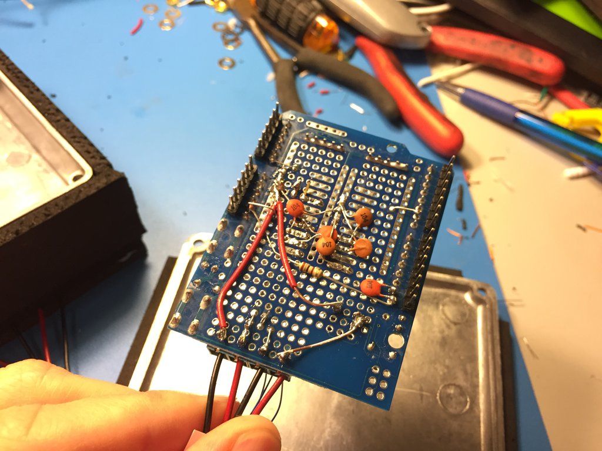

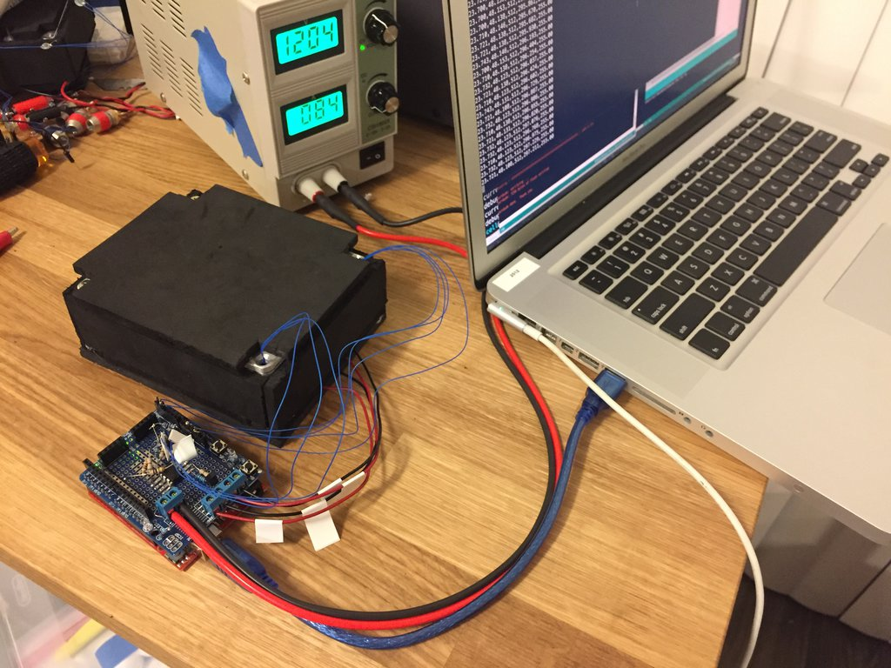

An Si7021 was used as the DUT to verify the temperature tracking.

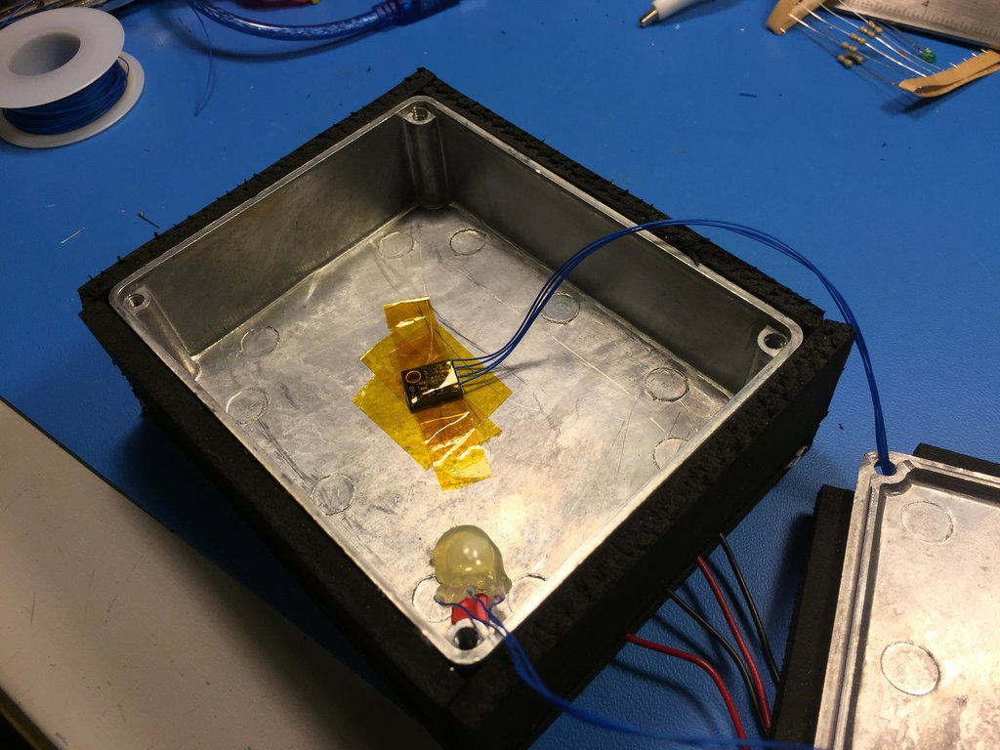

## run0:

These were a few initial runs as I was getting the setup connected and working.

~~During one of these runs I noticed a problem where the temperature measurement showed a siginicant offset when the 12V power supply (which powers the heater resistors) was turned on or off:~~ EDIT: the op amp is powered by the 12V rail, so of course removing the op amp's power affects the input reading...

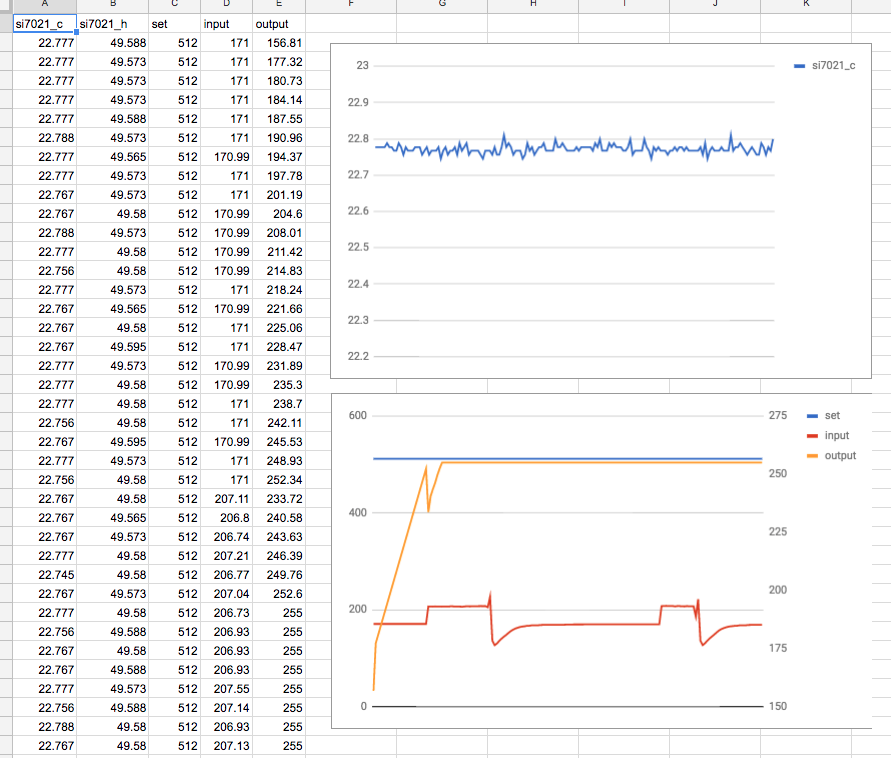

## run2:

- p: 0.5, i: 0.1, d: 0.01
- set point: 450
- period: 300ms

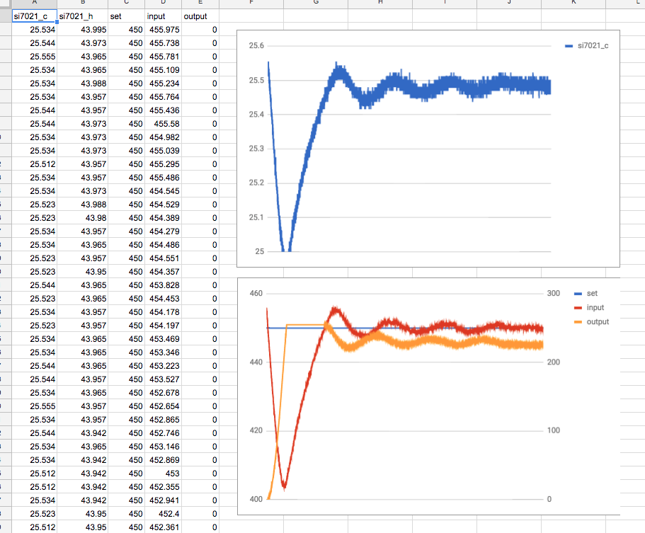

## run3:

- p: 0.75, i: 0.075, d: 0
- set point: 400
- period: 300ms

The unit left regulation overnight, when the temperature in my apartment dropped (went to bed at 71F, woke up at 9am at 67F).

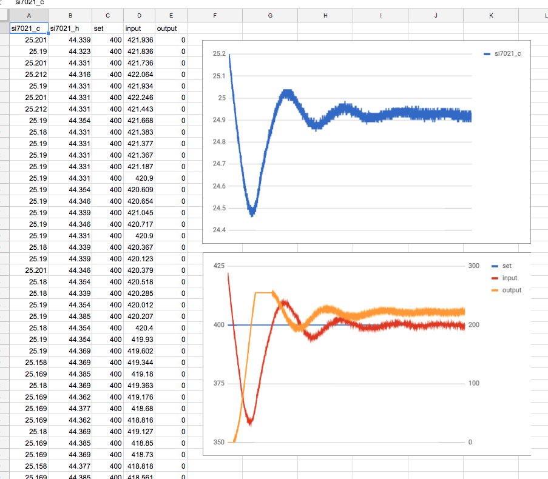

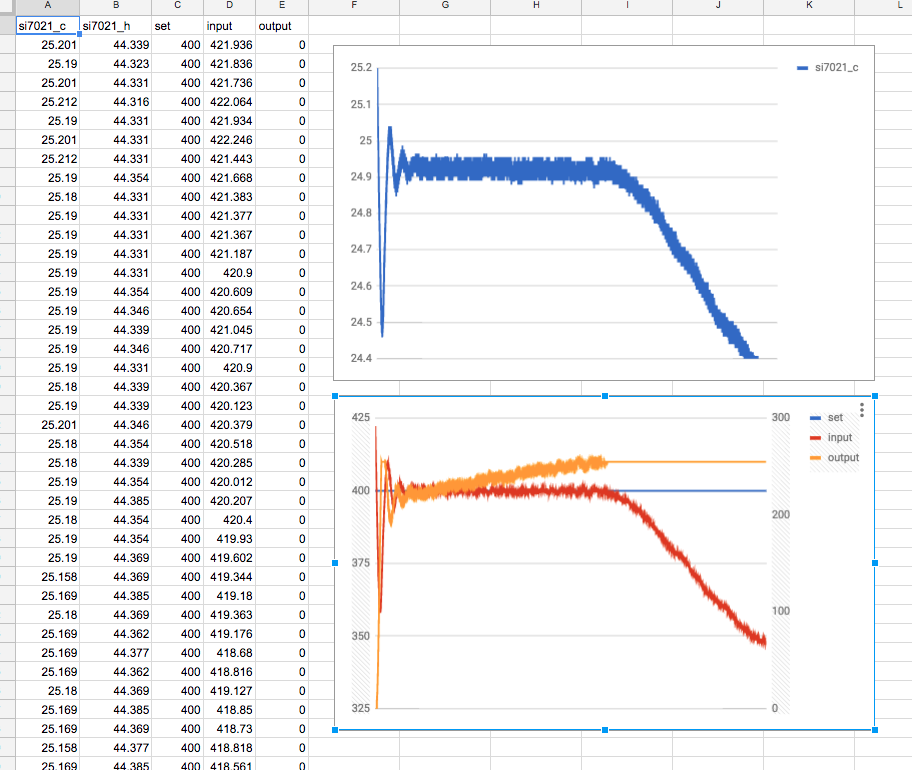

## run4:

- p: 0.75, i: 0.075, d: 0
- set point: 400
- period: 300ms

~~This run was just to demonstrate the problem of the 12V supply influencing the temperature reading.~~  EDIT: the op amp is powered by the 12V rail, so of course removing its power will affect the reading...

Half way into this run I turned off the 12V supply for a minute, then turned it back on.  Total run was about 3 minutes.

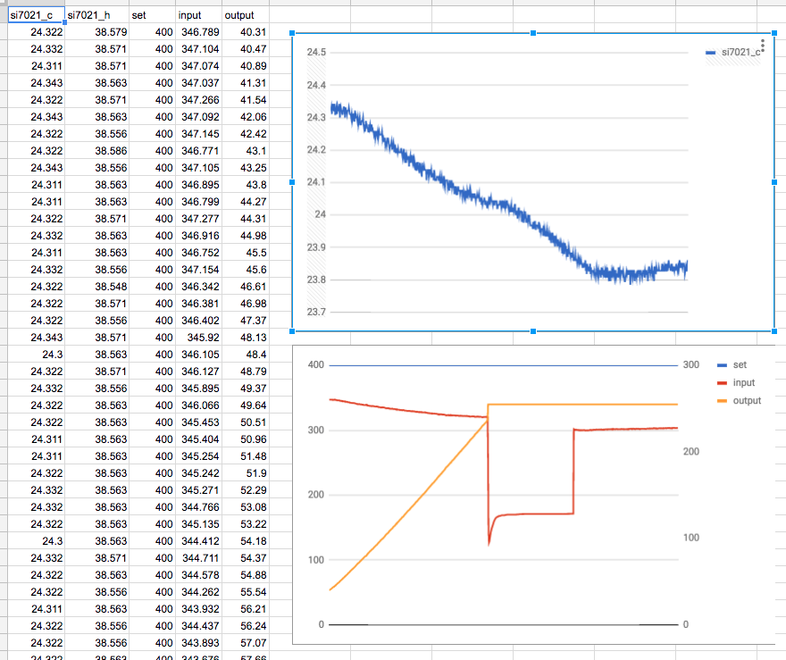

## run5:

For run 5, I modified the heater resistor circuit, by removing (shorting) one resistor above and below the 2N3904, for a total of eight 10 Ohm resistors, to increase the max current of the circuit.

The Si7021 output:

The ADC input (reading the amplified MCP9701A).  The scale is about 100 counts per C, making each gridline about 0.1C.

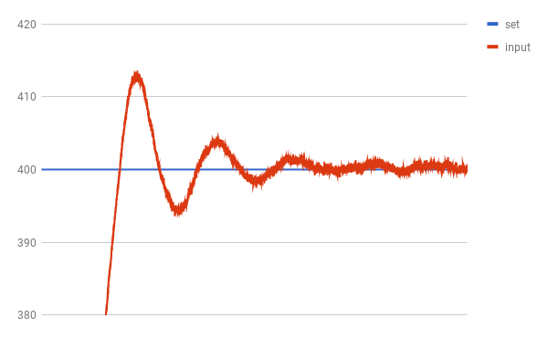

The PWM output (0 to 255):

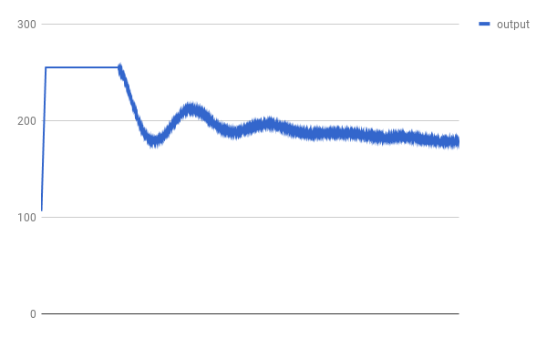

