## run0 

this was a run using the Arduino PID Autotune library.

results:
- p: 5.75
- i: 0.01

code excerpt from a modified copy of the example program which comes with the library:

```
byte ATuneModeRemember = 2;
double input = 0, output = 0, setpoint = 400;
double kp = 1, ki = 0.1, kd = 0;

double outputStart = 0;
//double aTuneStep = 127, aTuneNoise = 100, aTuneStartValue = 127;
double aTuneStep = 127, aTuneNoise = 5, aTuneStartValue = 127;
unsigned int aTuneLookBack = 300;

boolean tuning = true;
unsigned long  modelTime, serialTime;

PID myPID(&input, &output, &setpoint,kp,ki,kd, DIRECT);
PID_ATune aTune(&input, &output);

void setup()
{
```

the example program was also modified to spit out CSV and to terminate (infinite loop) upon completion of the tuning run:

```
  if (millis()>serialTime) {
    if (tuning) {
      Serial.print(setpoint);
      Serial.print(",");
      Serial.print(input);
      Serial.print(",");
      Serial.println(output);
    } else {
      Serial.print("kp: ");Serial.print(myPID.GetKp());Serial.print(" ");
      Serial.print("ki: ");Serial.print(myPID.GetKi());Serial.print(" ");
      Serial.print("kd: ");Serial.print(myPID.GetKd());Serial.println();
      while (true) delay(1);
    }
```

hmm, looking at the output chart, I don't think this worked correctly.  I think I set the `aTuneNoise` too low.

## run1

this was a test run to check on the above results.

- p: 5.75
- i: 0.01
- period: 300ms
- set point: 400

looks like `ki` is too small.


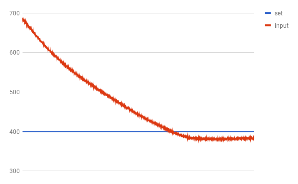

## run2

another autotune run.

```
double input = 0, output = 0, setpoint = 400;
double kp = 3, ki = 0.1, kd = 0;

double outputStart = 0;
double aTuneStep = 127;
double aTuneNoise = 50;
double aTuneStartValue = 127;
unsigned int aTuneLookBack = 300;
```

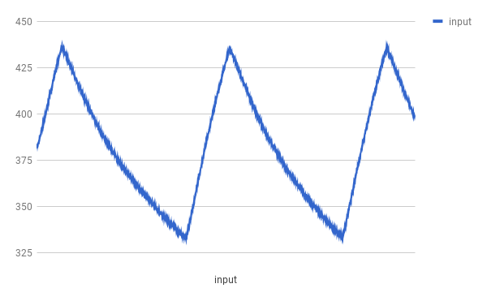

hmm, the results seem to be junk (p=1.26, i=0).

## run3

- p: 10
- i: 0.025
- period: 300ms
- set point: 405

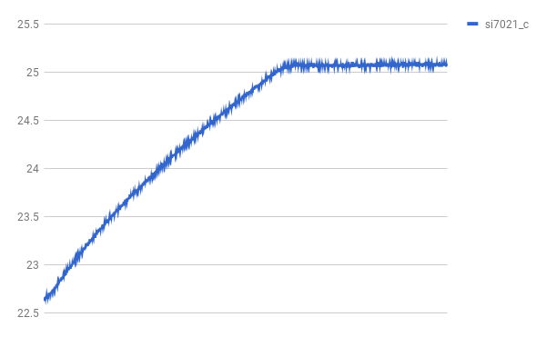


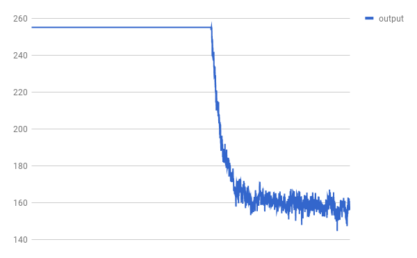

looks like I don't have enough Ki to steer the final correction.

## run4

bumping ki to 0.05.

- p: 10
- i: 0.05
- period: 300ms
- set point: 408

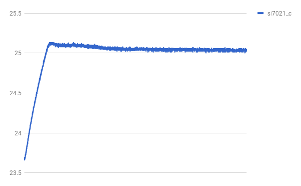


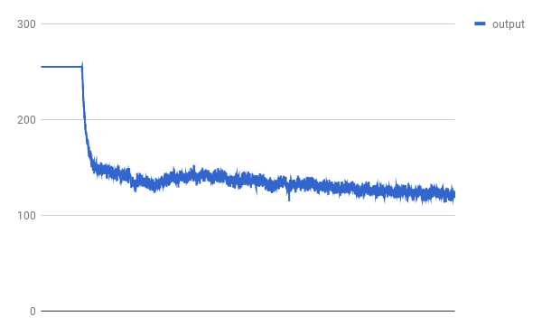

## run5

bumping ki to 0.1.

- p: 10
- i: 0.1
- period: 300ms
- set point: 407


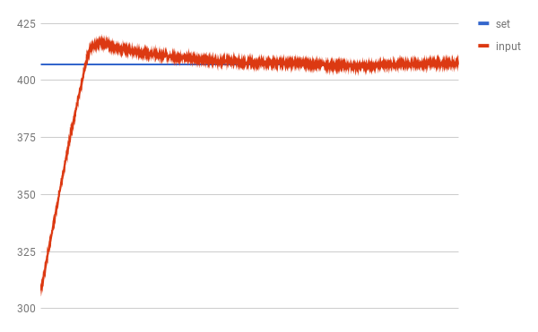


## run6

modifying the arduino code to accumulate and average samples for as long as it can during each loop period.  bumping the loop period to 5000ms.  hopefully this will reject more temperature noise (which would allow a derivative term).

- p: 10
- i: 0.1
- period: 5000ms
- set point: 407

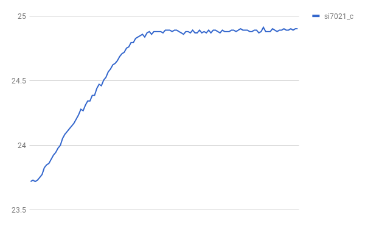


## run7

bumping up the ki term.

- p: 10
- i: 0.5
- period: 5000ms
- set point: 407


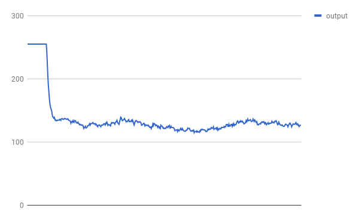

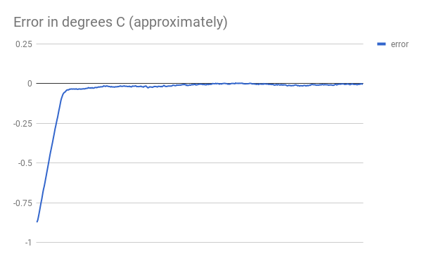

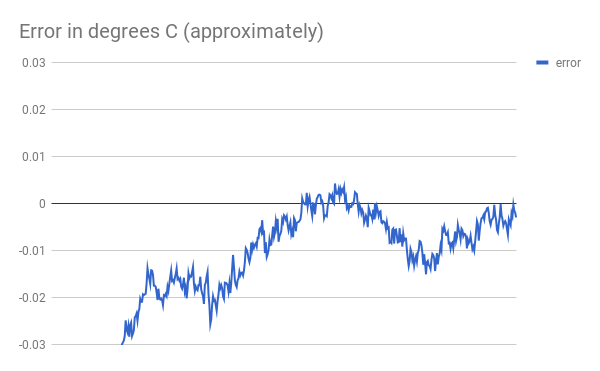

## run8 series

bumping up the ki term, shortening the period, and testing at various set-points to get an ADC to Celcius mapping.

- p: 10
- i: 0.75
- period: 3000ms
- set point: 900

## run9 series

I hooked up a second Si7021 (with the idea of using it to track ambient temperature).  Here, I've put them both in the chamber to see how closely they track each other.

## run10 series

- p: 10
- i: 0.75
- period: 3000ms
- set point: 228

This was the first in which I also tracked the ambient temperature.  Swing in ambient temperature is essentially responsible for all of the error.  It looks like the internal temperature variance is about 50x better than ambient variance.


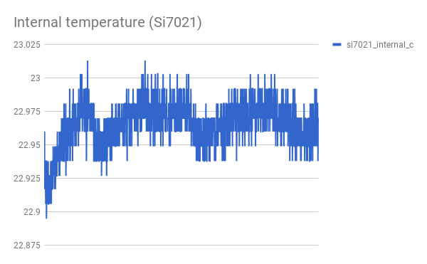
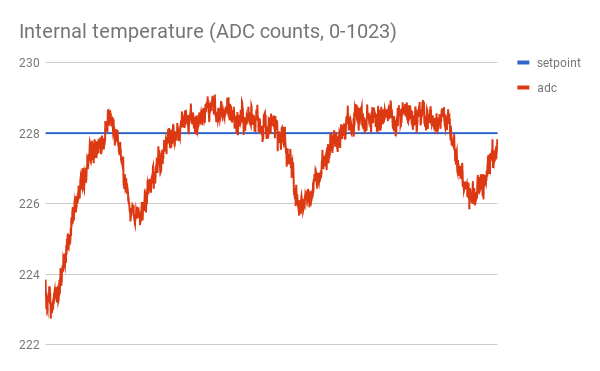


## run11

bumping ki to 1.0.

- p: 10
- i: 1
- period: 3000ms
- set point: 231


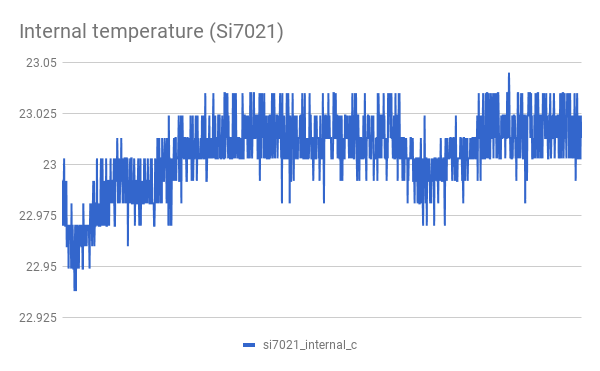


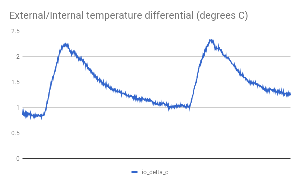
