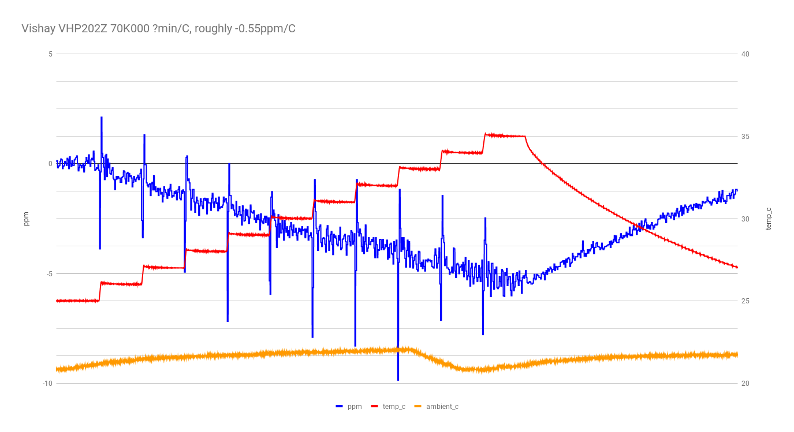
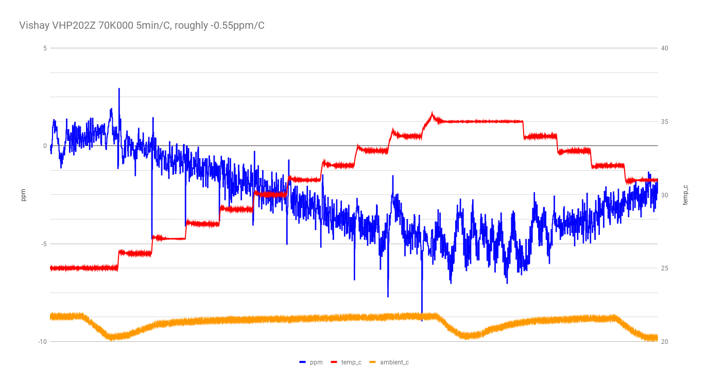
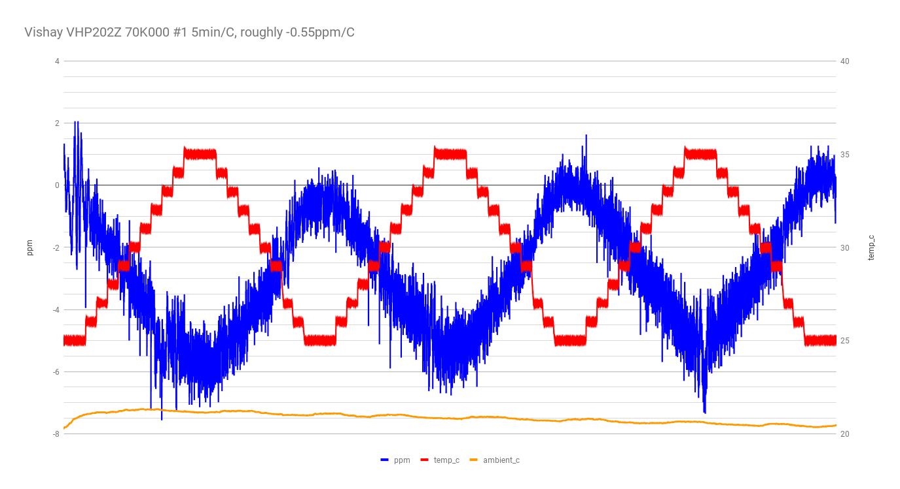
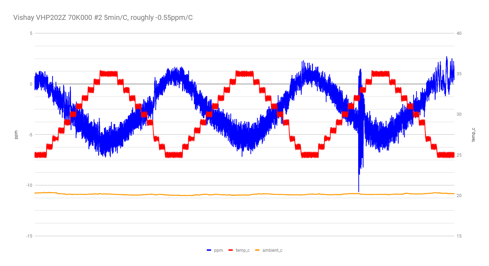

returning to basic 4-wire mode with DUT in the TEC chamber, ramping from 25C to 35C, etc.

## run 1

just a test run.

## run 2

VHP202Z 70K #1

25C to 35C ramp in 1C steps, 5min/step.

Si7021 records ambient temperature.

oops, I mixed up program1 (one ramp) and program2 (multiple ramps up and down).

## run 3

VHP202Z 70K #1

this was an extended (~6 hour) run with multiple ramps up and down.

So, VHP202Z 70K #1 is somewhere between -0.5 and -0.55 ppm/C.

## run 4

VHP202Z 70K #2

