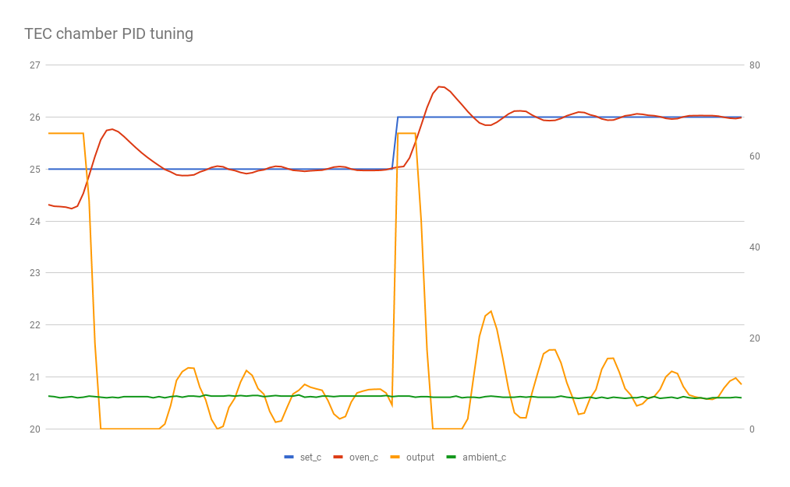
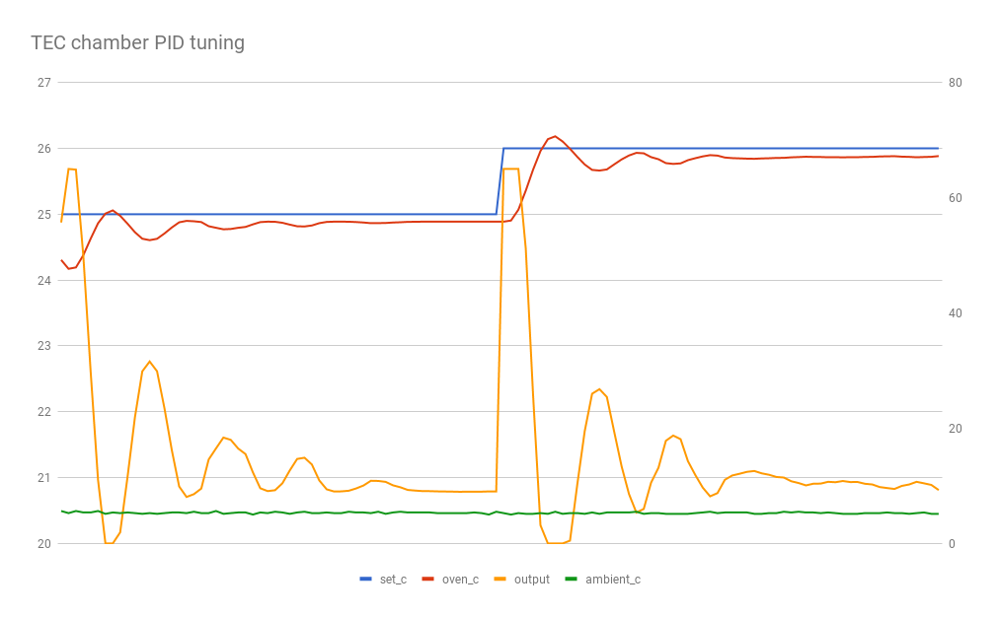
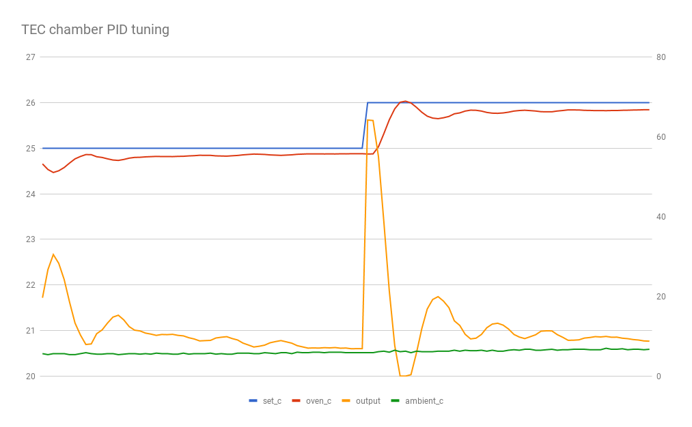

revisiting the tuning on my TEC chamber.

## run1

- p: 7.0
- i: 0.75
- d: 0.5
- period: 1000ms

## run2

- p: 7.0
- i: 0.0
- d: 0.0
- period: 1000ms

## run3

- p: 5.0
- i: 0.0
- d: 0.0
- period: 1000ms

