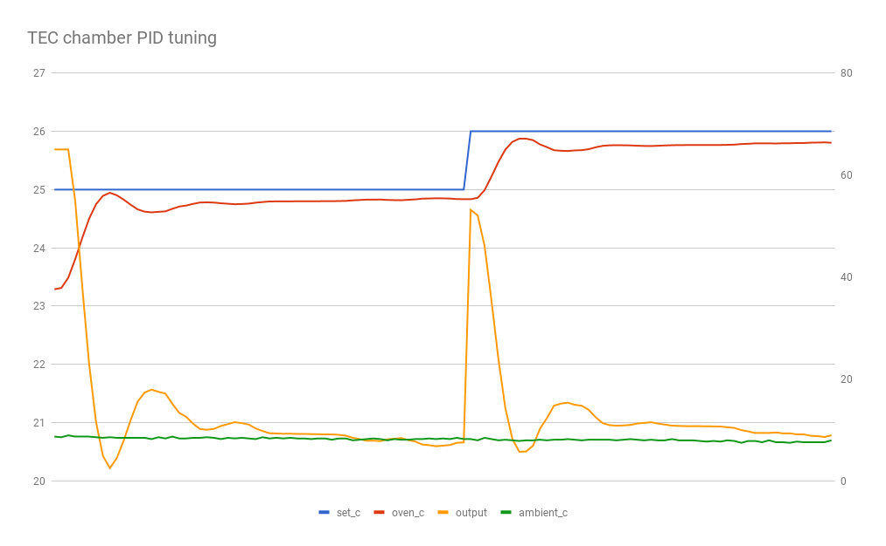
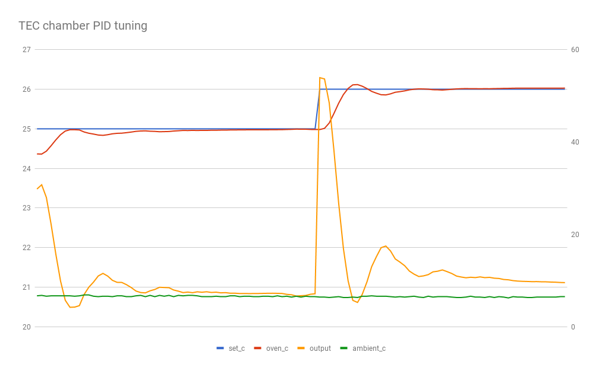
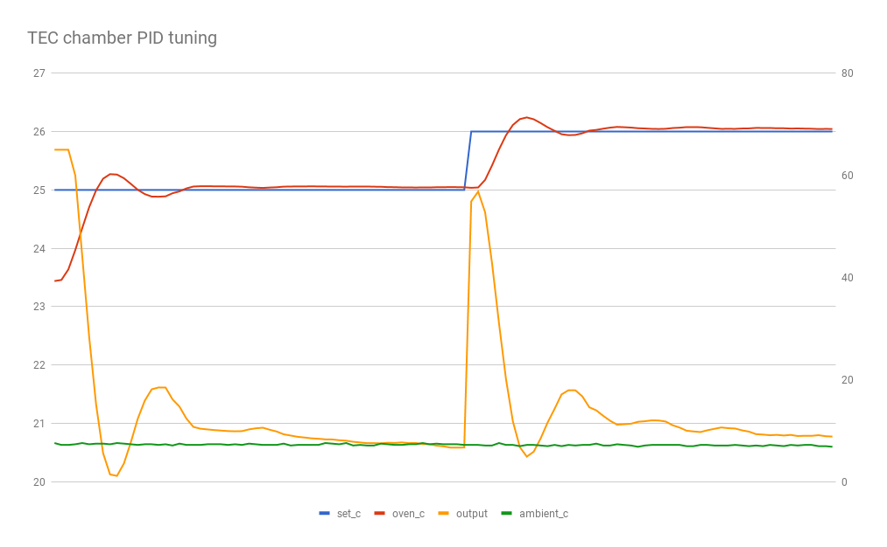
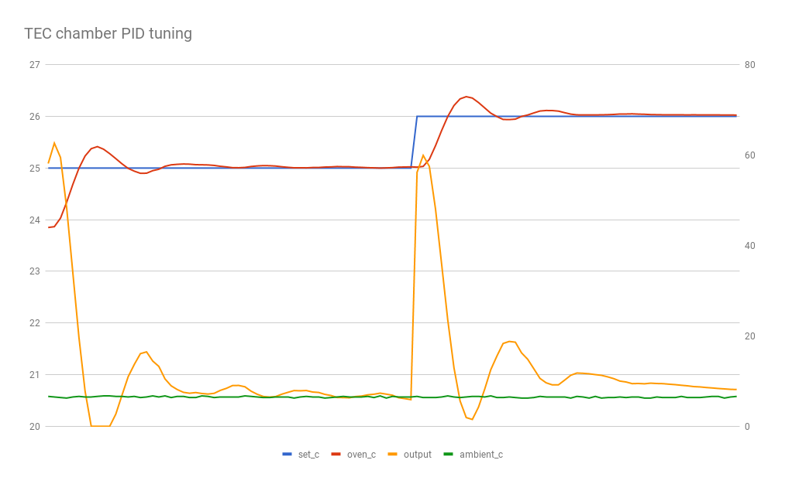
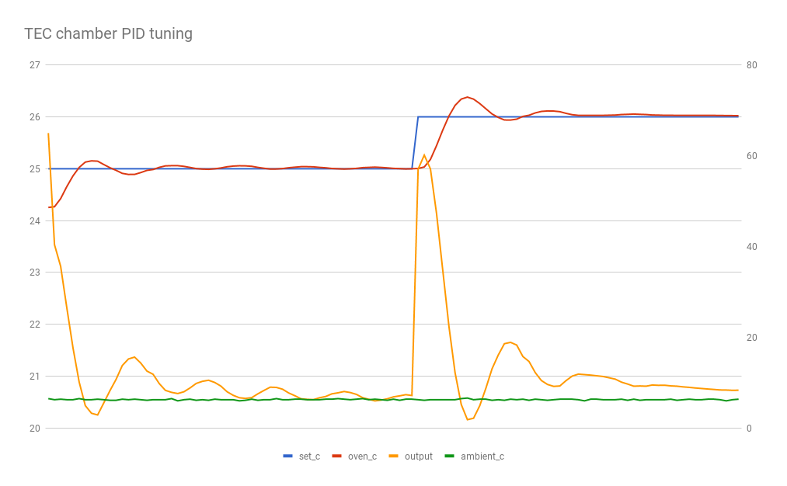
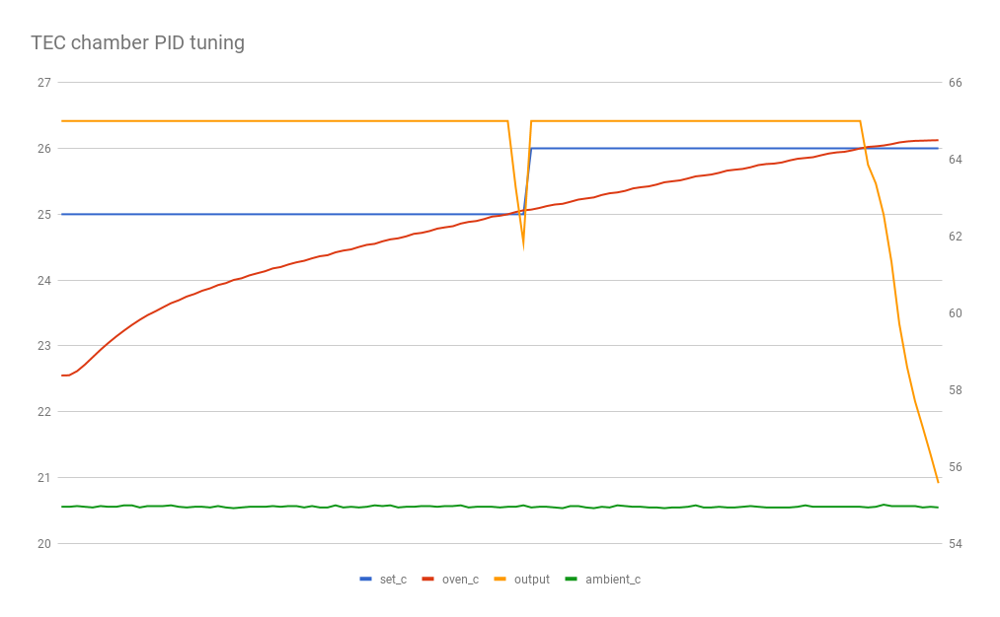
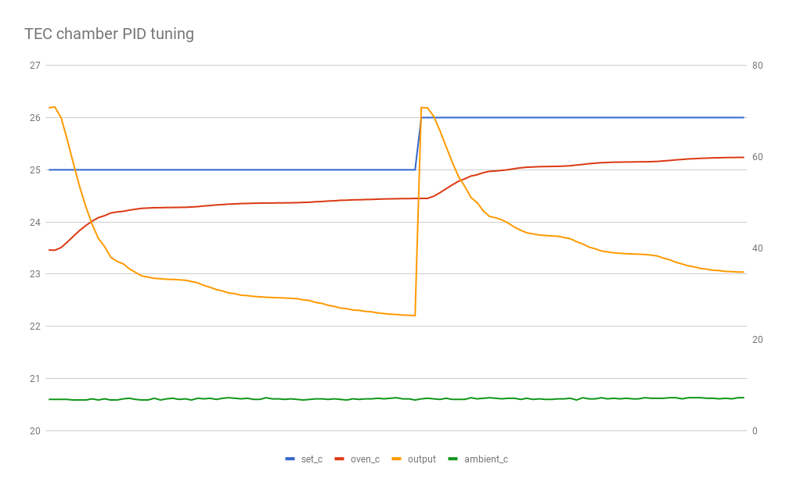

revisiting the tuning on my TEC chamber.

## run1

- supply: 12V
- p: 7.0
- i: 0.75
- d: 0.5
- period: 1000ms
- output limit: 65 (~1000mA)

## run2

- supply: 12V
- p: 7.0
- i: 0.0
- d: 0.0
- period: 1000ms
- output limit: 65 (~1000mA)

## run3

- supply: 12V
- p: 5.0
- i: 0.0
- d: 0.0
- period: 1000ms
- output limit: 65 (~1000mA)

## run4

- supply: 12V
- p: 4.0
- i: 0.0
- d: 0.0
- period: 1000ms
- output limit: 65 (~1000mA)

## run5

- supply: 12V
- p: 4.0
- i: 0.1
- d: 0.0
- period: 1000ms
- output limit: 65 (~1000mA)

## run6

- supply: 12V
- p: 4.0
- i: 0.2
- d: 0.0
- period: 1000ms
- output limit: 65 (~1000mA)

## run7

- supply: 12V
- p: 4.0
- i: 0.4
- d: 0.0
- period: 1000ms
- output limit: 65 (~1000mA)

## run8

- supply: 12V
- p: 4.0
- i: 0.4
- d: 0.1
- period: 1000ms
- output limit: 65 (~1000mA)

## run9

- supply: 5V
- p: 4.0
- i: 0.4
- d: 0.1
- period: 1000ms
- output limit: 65 (~360mA)

## run10

- supply: 5V
- p: 4.0
- i: 0.4
- d: 0.1
- period: 1000ms
- output limit:  (~1000mA)

