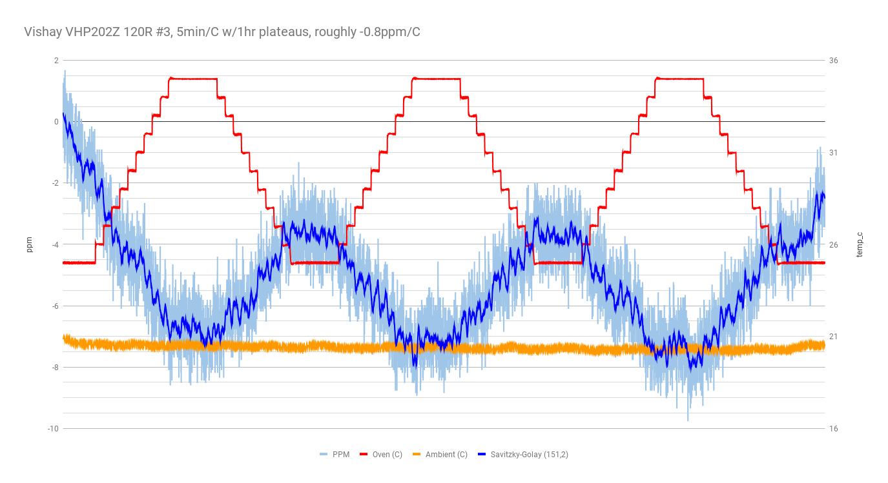
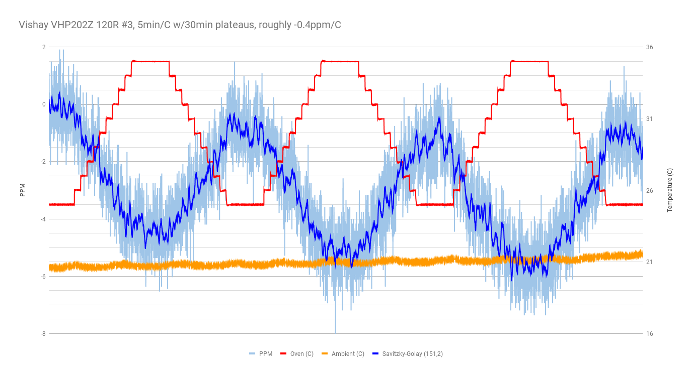
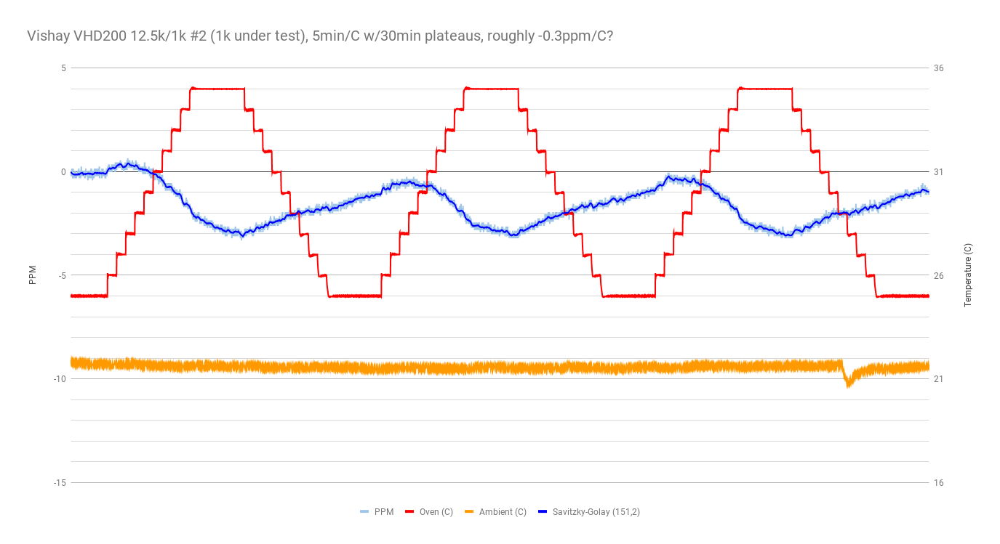
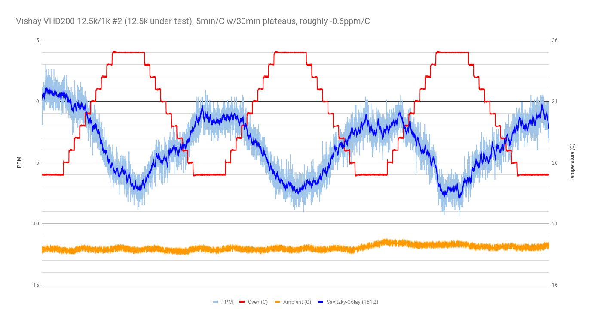
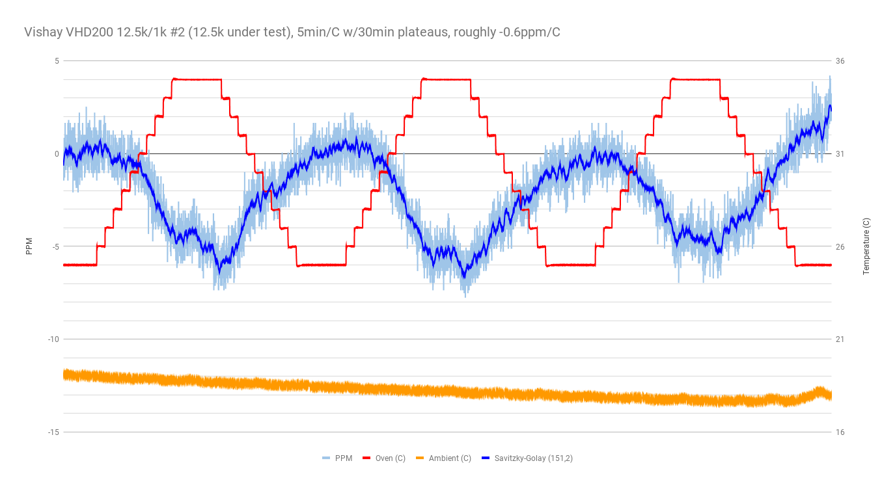
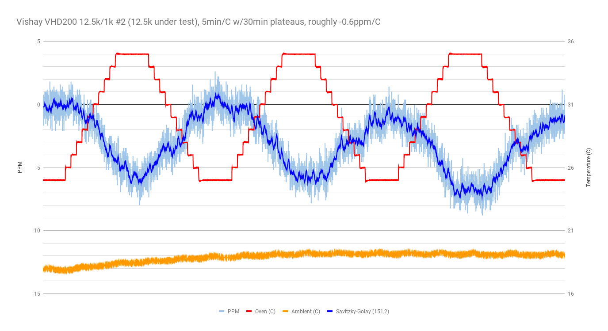
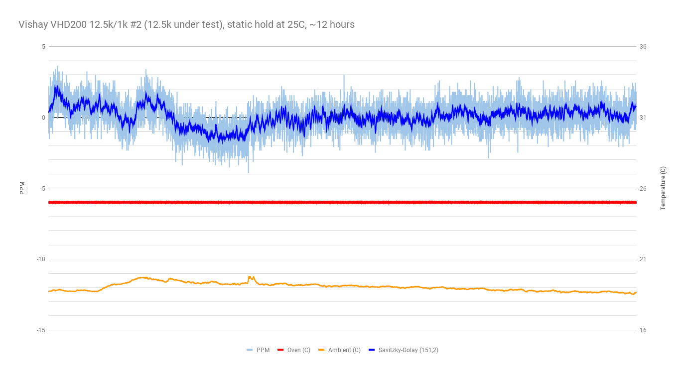
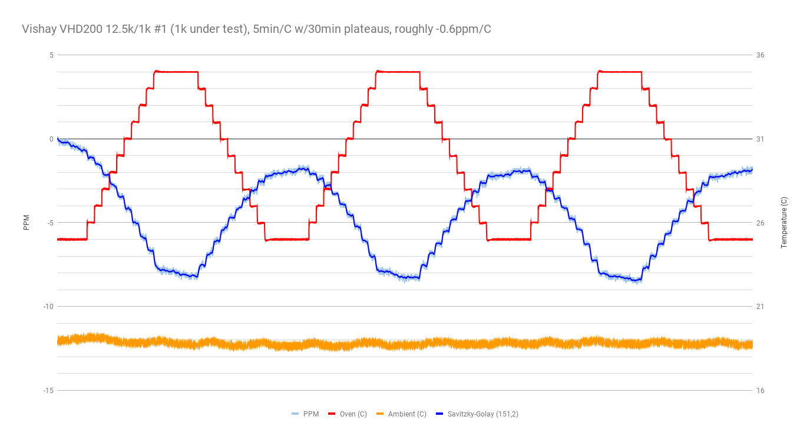
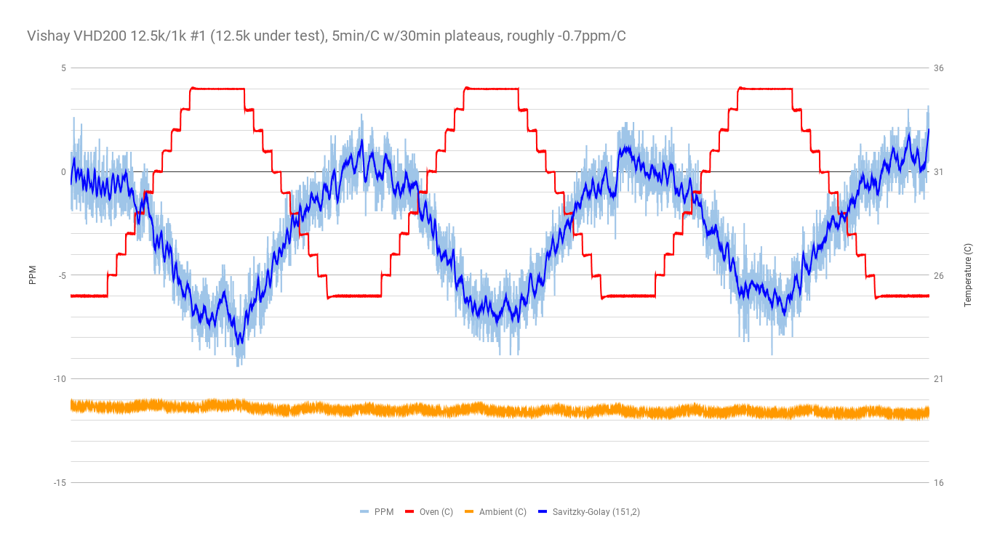
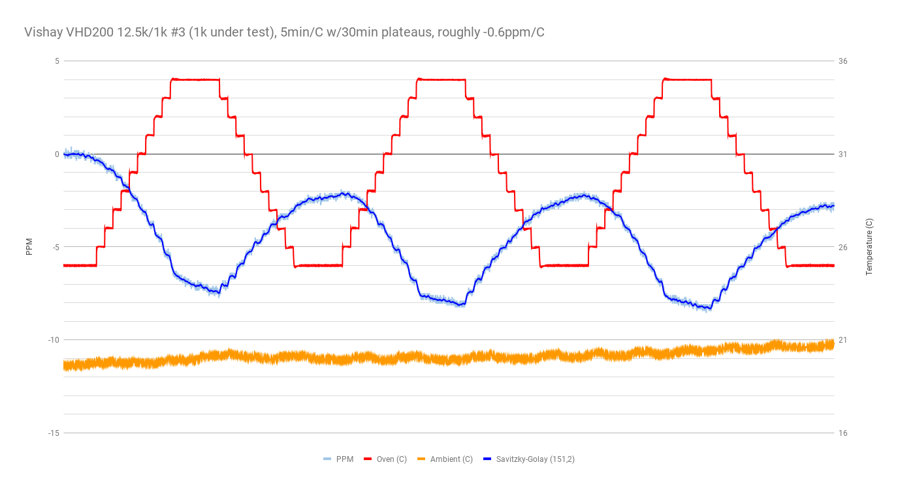

more 4-wire mode with DUT in the TEC chamber, ramping from 25C to 35C, etc.

- meter: 34401A in 4-wire mode.
- chamber: Hammond 1590A with 12706 peltier, Arduino-based half-bridge controller.
- power supply set to 5V.
- each step is 1C and 5 minutes, with 30 minute plateaus at 25C and 35C.

## run 1

VHP202Z 70K #2

25C to 35C ramp in 1C steps, 5min/step.

this was an extended (~8 hour) run with multiple ramps up and down.

Si7021 records ambient temperature.

about -0.6ppm/C, very similar to VHP202Z 70K #1.

## run 2

VHP202Z 70K #3

similar, maybe -0.45ppm/C, but it is hard to tell because the signal is either slowly shifting or I am seeing some hystersis.  I'll try another run and see if it settles down.

## run 3

VHP202Z 120R #1

I had anticipated that the 120R result would be much noisier (it is very low in the ADC's range), and was pleasantly surprised to see a useful result.

The signal does appear to be wandering, moreso than with the 70K resistors.  Again, I'm not sure if this is the meter wandering, or if this represents actual hystersis of the resistor.  Performing a multi-day run with perhaps 10 ramps up and down would be useful.

About -0.9ppm/C.

## run 4

VHP202Z 120R #2

About -1.0ppm/C.

## run 5

VHP202Z 120R #2

ok, let's see if we can get a handle on the drift of the meter / system-as-a-whole.

let's just maintain 25C for one hour and see what we get.

ok, so that accounts for at least some of the "wandering" I'm seeing in the above charts.  good to know.

here's the same chart with the ambient variance zoomed-in.

## run 6

VHP202Z 120R #2

starting a longer run (7 up/down cycles, ~19 hours).

oops, after 127 steps the program got stuck, because I used an int8_t.  drat.

## run 7

VHP202Z 120R #3

Perhaps as good as -0.35ppm/C.  Significantly better than 120R #1 and #2.

## run 8

A second run of VHP202Z 120R #3.

About -0.4ppm/C.

## run 9

VHD200 12.5k/1k divider #2 (1k under test)

Two observations:
- Whoa, what a low noise signal!  Fantastic!
- It looks like there was insufficient thermal coupling -- the ppm response lags behind the thermal set point.  Did the resistor come loose before the test started?

## run 10

VHD200 12.5k/1k divider #2 (1k under test)

Let's try extending the duration of each step.  Here, each step is 15 minutes, and each plateau is 1.5 hours.

I don't think my system is equiped to measure the tempco of this resistor.  The temperature in the room decreased significantly towards the end of the graph (we had a cold front in Austin last night and it got down to 30F), and I suspect this is visible in the resistor's rise towards the end.

My best guess between the last graph and this one would be -0.3ppm/C.

## run 11

VHD200 12.5k/1k divider #2 (12.5k under test)

## run 12

this was a repeat of run 11, I think.

## run 13

yet another repeat of run 11, I think.

## run 14

VHD200 12.5k/1k divider #2 (12.5k under test)

This was a static hold at 25C for almost 12 hours.

## run 15

VHD200 12.5k/1k divider #1 (1k under test)

## run 16

VHD200 12.5k/1k divider #1 (12.5k under test)

## run 17

VHD200 12.5k/1k divider #3 (1k under test)

## run 18

VHD200 12.5k/1k divider #3 (12.5k under test)

