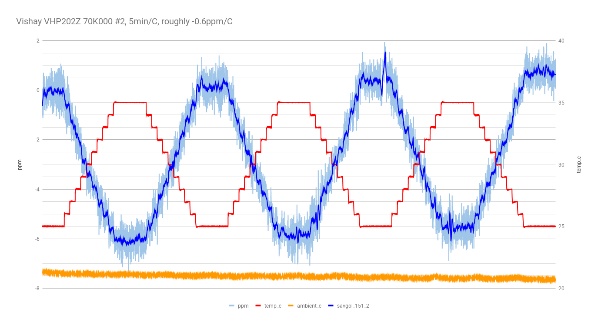
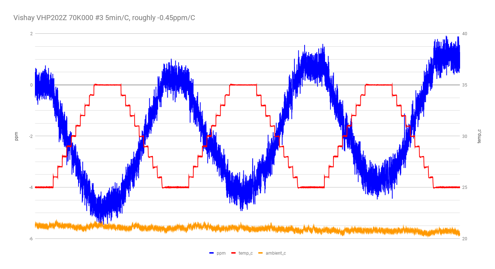

more 4-wire mode with DUT in the TEC chamber, ramping from 25C to 35C, etc.

- meter: 34401A in 4-wire mode.
- chamber: Hammond 1590A with 12706 peltier, Arduino-based half-bridge controller.
- power supply set to 5V.

## run 1

VHP202Z 70K #2

25C to 35C ramp in 1C steps, 5min/step.

this was an extended (~8 hour) run with multiple ramps up and down.

Si7021 records ambient temperature.

about -0.6ppm/C, very similar to VHP202Z 70K #1.

## run 2

VHP202Z 70K #3

