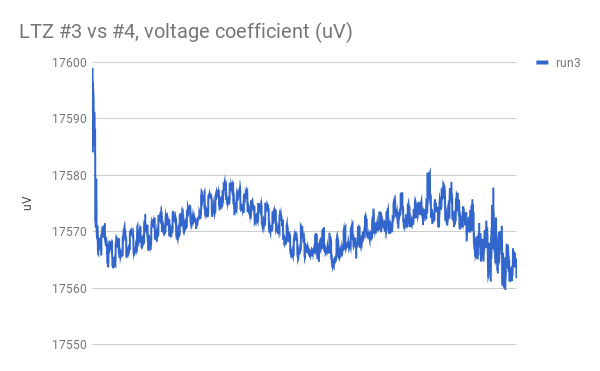
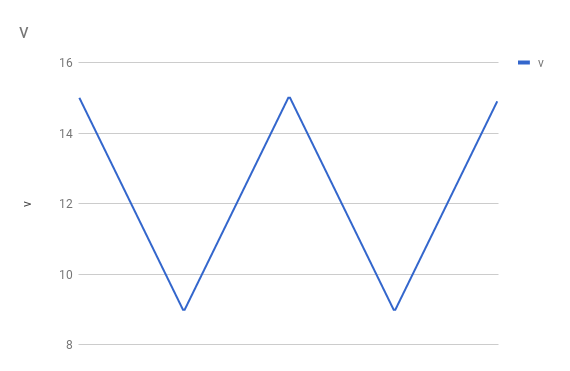
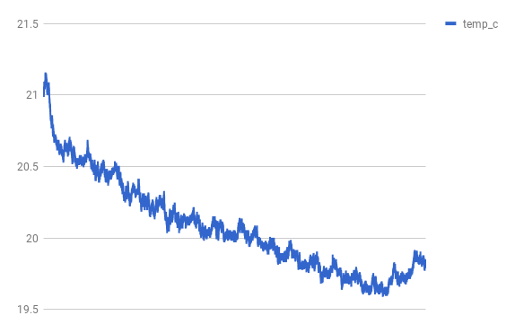
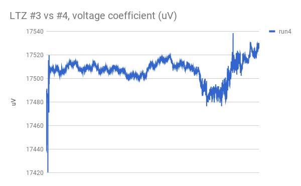
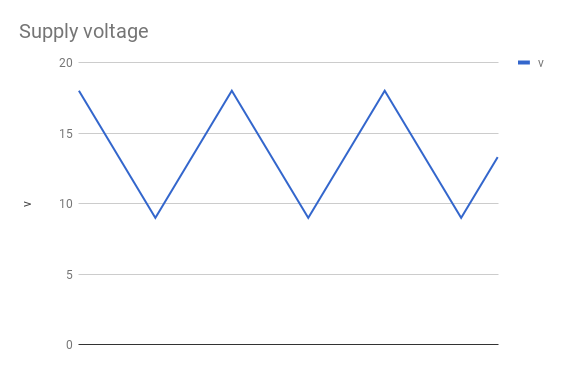
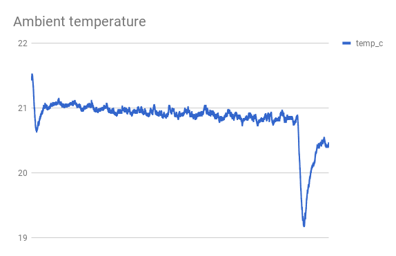
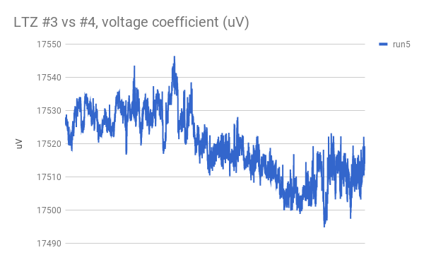
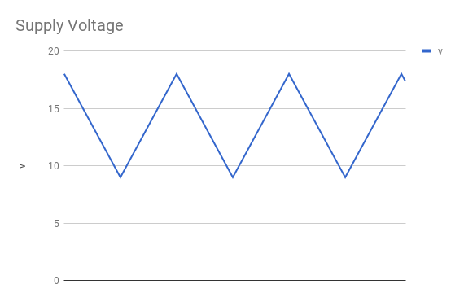
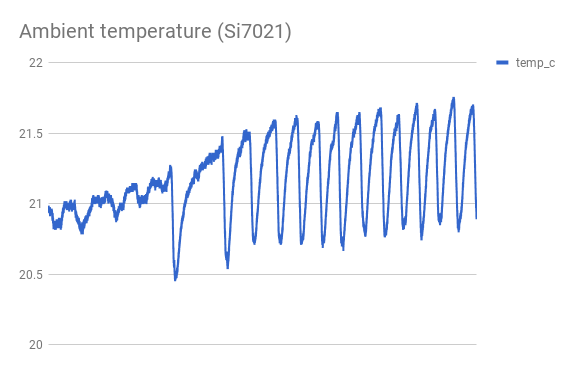

## run 1:

LTZ #3 and #4, back-to-back.

LTZ #3 powered by lipo into 7815 regulator.

LTZ #4 powered by lipo into programmable LM317.

LTZ #4 has had the input protection diode as well as the heater zener bypassed.

data acquisition: HP 34401A (slow 6-digit, 10GOhm) for voltage and Si7021 for temperature.

This was just a test run to get everything set up.

## run 2:

HP in fast 6-digit mode.

Varying LTZ #4 voltage from 9.0V to 8.0V, in steps of 0.1V every 5 seconds.

This run is to establish at what point the LTZ heater circuit falls out of regulation.

## run 3:

HP in slow 6-digit mode.

Varying LTZ #4 voltage from 15.0V to 9.0V, in steps of 0.1V every 120 seconds.

This run is to measure the PSRR of LTZ #4.

## run 4:

This time varying from 18.0V to 9.0V in 0.1V steps every 60 seconds.

I have also introduced an opto-isolator inbetween the laptop and the LM317, so the LTZ's should be floating now.  I have verified that the USB shield of the laptop is in fact connected directly to the ground terminal of my wall outlet when my laptop is plugged in.

## run 5:

Repeat of run 4, but during the day while I was at work.

This time I used a `sleep 120` command before starting the logs, which gave me
enough time to leave the room and for the laptop's display to turn off, and this
seems to have cleared up the leading noise from the charts.

You can see when the A/C started cycling on as it warmed up towards the afternoon.

