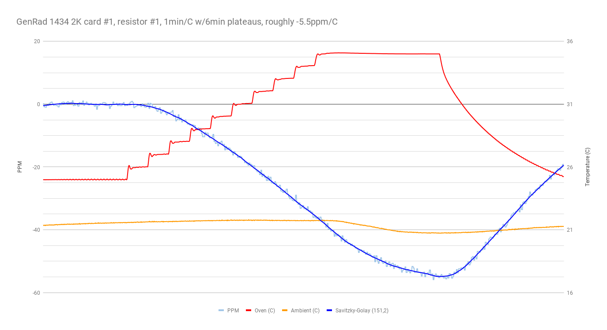
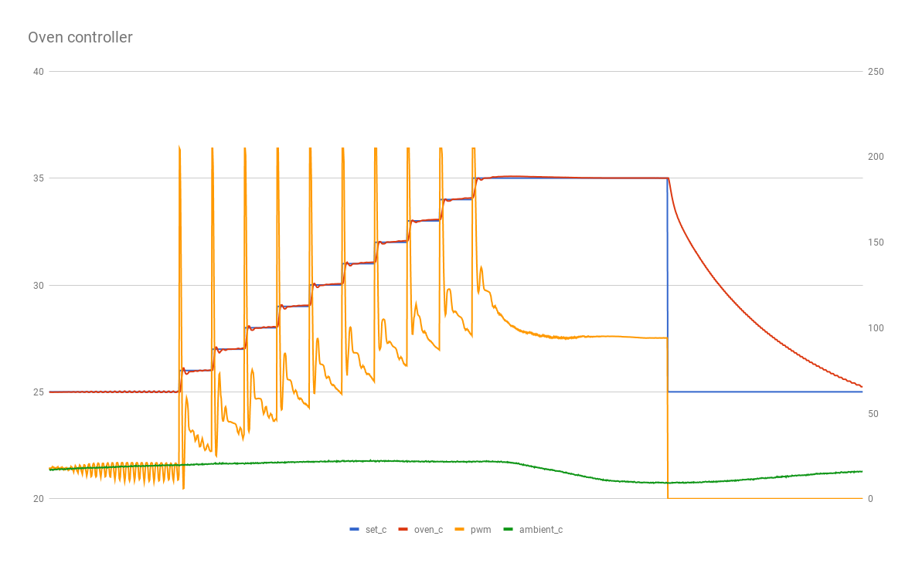
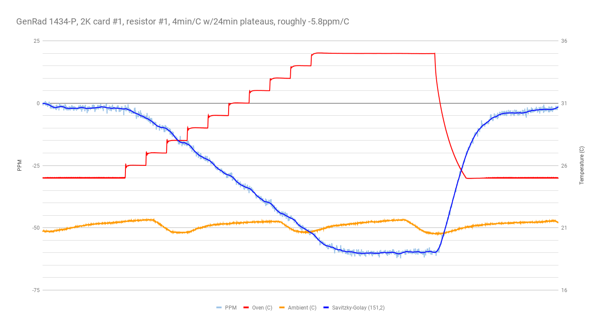
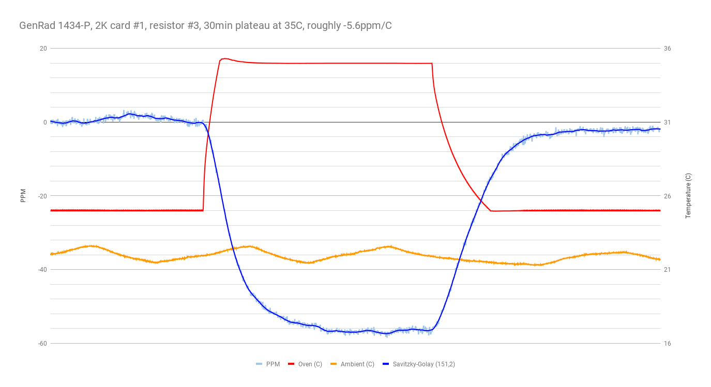
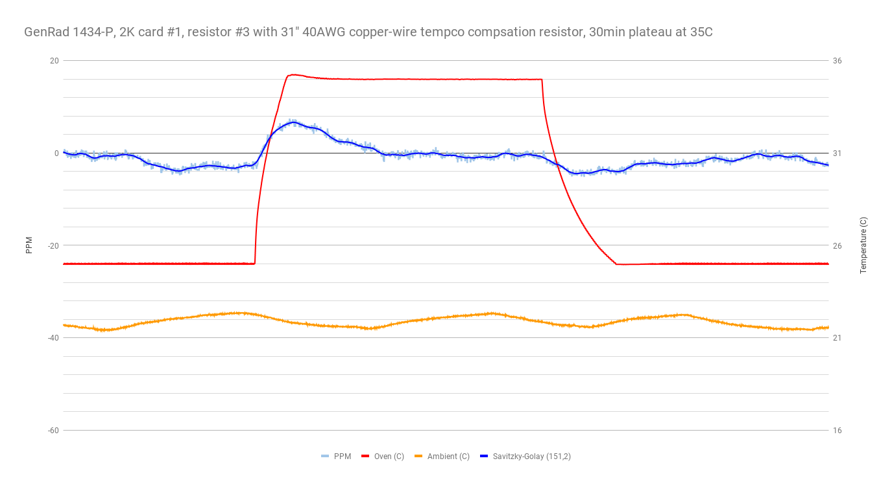
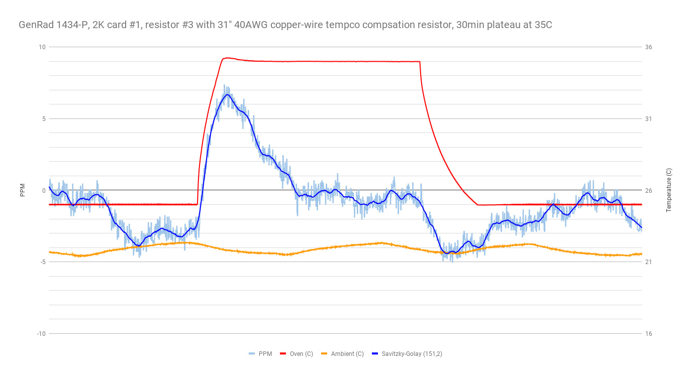
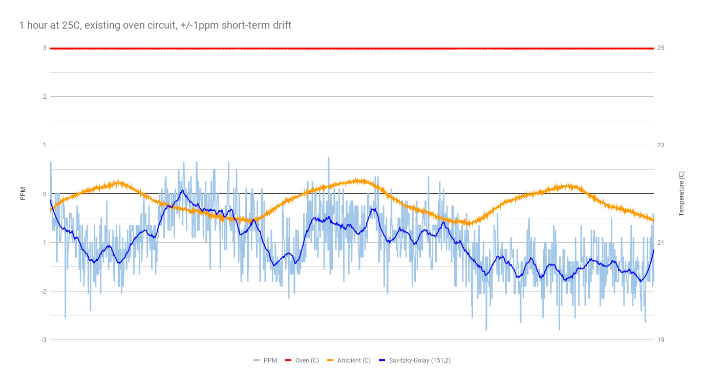
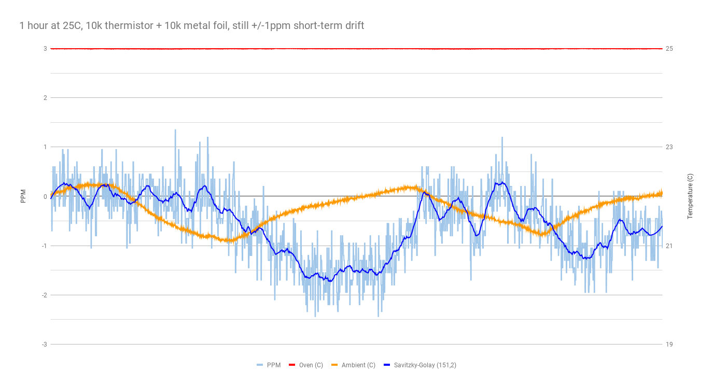

more 4-wire mode with DUT in the TEC chamber, ramping from 25C to 35C, etc.

- meter: 34401A in 4-wire mode, slow 6-digit.
- chamber: Hammond 1590A with 12706 peltier, Arduino-based half-bridge controller.
- power supply set to 5V.
- Si7021 records ambient temperature.

## run 1

GenRad 1434-P **2k** resistance **card #1, resistor #1**.

- 1 minute/C, with 6 minute plateaus at 25C and 35C.

This was just a quick run to verify my setup and to see if the tempco was negative.

hmm, looks like I've got a bit of instability in my oven's PID loop:

## run 2

GenRad 1434-P **2k** resistance **card #1, resistor #1**.

- 1 minute/C, with 24-minute plateaus at 25C and 35C.

About -5.8ppm/C.

## run 3

GenRad 1434-P **2k** resistance **card #1, resistor #2**.

- 5 minute/C, with 30-minute plateaus at 25C and 35C.

About -6.3ppm/C.

## run 4

GenRad 1434-P **2k** resistance **card #1, resistor #3**.

- 30-minute plateau at 35C.

About -5.6ppm/C.

## run 5

GenRad 1434-P **2k** resistance **card #1, resistor #3**, with hand-made copper wire resistor for tempco compensation.

- copper wire resistor is 31 inches of 40AWG magnet wire wrapped around a 10meg resistor, in series with the 2k resistor.
- 30-minute plateau at 35C.

As expected, there is some thermal lag between the two resistors, but after the temperature stabilizes, the tempco appears to be beneath the drift of my measurement system (probably 0.5ppm/C).  Pretty neat!

## run 6

The same 2k resistor + copper-wire resistor from run 5, but held at 25C for one hour, to evaluate the stability of my measurement / temp-control system.

Looks like +/-1ppm short-term drift in the measurement system.

## run 7

The 10k thermistor in this temperature-control circuit is linearized by placing it in series with a 10k 1% metal film resistor.  Thus, if the ambient temperature causes the 1% metal film resistor to drift, that will introduce error into the temperature control loop.

For this run, I've replaced the 10k 1% metal film resistor (likely at least 100ppm/C) with a 10k metal foil resistor (less than 5ppm/C).

No improvement.

