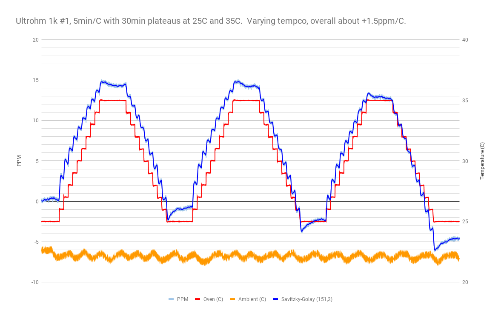
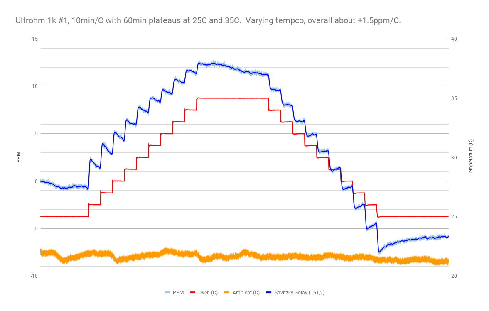

more 4-wire mode with DUT in the TEC chamber, ramping from 25C to 35C, etc.

- meter: 34401A in 4-wire mode, slow 6-digit.
- chamber: Hammond 1590A with 12706 peltier, Arduino-based half-bridge controller.
- power supply set to 5V.
- Si7021 records ambient temperature.

## run 1

3 ramps up and down between 25C and 35C, 5min/C with 30min plateaus at 25C and 35C.

It looks like the tempco is non-linear, as the steps are larger near 25C and decrease towards 35C.  The "box" tempco from 25C to 35C is about +1.5ppm/C, but unfortunately the steeper part of the tempco slope is at 25C, possibly a bit over 2ppm/C there.

However, it is difficult to tell for sure, as the resistor shows a bit of "overshoot" on the tempco, and then relaxes a bit during the 30-minute plateaus.  Perhaps extended time on the steps would show different behavior.

## run 2

1 ramp up and down between 25C and 35C, but with 10min/C and 60-minute plateaus.

Looks like there is still some hysteresis at each temperature cycle.  Perhaps further cycles will relax this a bit.
