I used a low-noise amplifier to measure the "1/F" noise (0.1Hz to 10Hz noise) of a few LTZ1000 voltage references.

## Summary of results

Here is a table of all of the 60-second measurements:

| LTZ | date code | source | noise, p-p | noise, RMS |
| --- | --- | --- | --- | --- |
| #2 | 0415 | ebay | 0.984uV | 208nV |
| #3 | 1101 | ebay | 1.22uV | 252nV |
| #5 | 1747 | digikey | 0.840uV | 176nV |
| #6 | 1747 | digikey | 0.928uV | 194nV |
| #7 | 1747 | digikey | 0.816uV | 168nV |
| #8 | 1750 | digikey | 0.968uV | 191nV |
| #9 | 1750 | digikey | 1.04uV | 199nV |
| #10 | 1750 | digikey | 0.776uV | 171nV |
| #11 | 9811 | ebay | 0.720uV | 0.143uV |

## Equipment used

- [LTZ1000ACH](http://cds.linear.com/docs/en/datasheet/1000afe.pdf) chips from various sources, socketed in a [PX-ref](https://github.com/pepaslabs/px-ref) board.
- Pipelie 0.1Hz - 10Hz LNA (zlymex design) [[1](http://www.eevblog.com/forum/metrology/diy-low-frenquency-noise-meter/msg1005460/#msg1005460)] [[2](http://www.eevblog.com/forum/metrology/diy-low-frenquency-noise-meter/msg1401067/#msg1401067)] [[Manual](https://www.eevblog.com/forum/metrology/diy-low-frenquency-noise-meter/?action=dlattach;attach=385141)]
- Rigol DS1102E oscilloscope
- RG58 18-inch BNC cable (Jameco Valuepro, part [#102315](https://www.jameco.com/z/RG58U1-5-R-Cable-Assembly-RG58-U-1-5-BNC-to-BNC-50-Ohm_102315.html))
- Canare [L-5CFB](http://www.canare.com/ProductItemDisplay.aspx?productItemID=80) RG6 18-inch BNC cable ($9.45 at [ebay](https://www.ebay.com/itm/121143686632))
- BNC shorting cap
- Imusa Caldero / Dutch Oven (38cm) (purchased from HEB), fitted with a BNC jack

## Scope setup

For all measurements, the 20MHz bandwidth limit was enabled.

The scope was configured to use a "100x" probe.  This means 1V on the scope is actually 1uV measured, and 100mV on the scope is actually 100nV measured, etc.

## A note on being patient

Note that it can take up to 5 minutes (I measured about 4:30) for the 1000uF input capacitor of the LNA to stabilize.  When it does, you will see both LED indicators on the LNA glowing.  If one of the LED's is not lit, the amp is in saturation and will not produce correct readings.

I got bitten by this when initially measuring the noise floor of the system while the LNA was still in saturation, and read a value which was much lower than the actual noise floor:

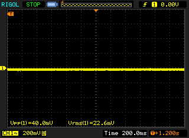

After waiting for the LNA to stabilize, the true noise floor could be measured.

1/F noise has a certain recognizable characteristic to it.  If your output doesn't look like that (even when measuring the noise floor), you need to wait a bit longer.

## Setup 1

The LNA is connected to the DS1102E using the Jameco RG58 cable, with a BNC short on the input of the LNA.

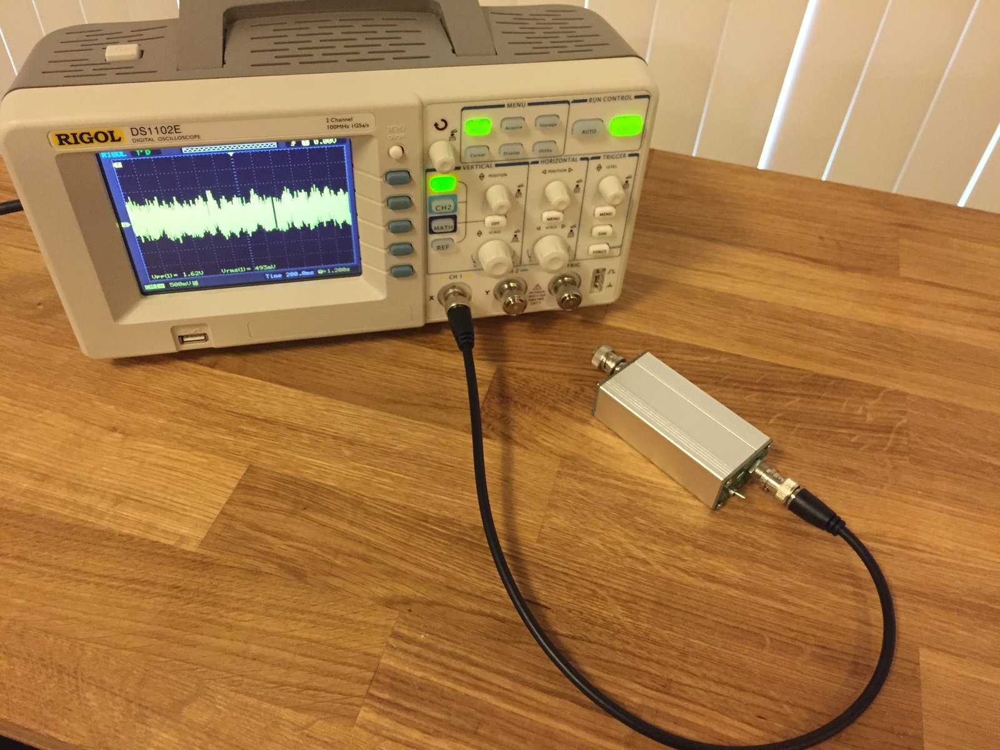

Here is the noise floor:

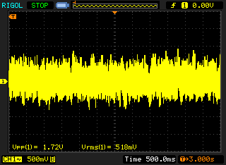

1.72uV peak-to-peak, 518nV RMS.  This is already greater than the noise we expect to measure on an LTZ1000, so this setup is not useable.

Additionally, this setup is very sensitive to the environment.  Here is the result of me vigorously  flapping my arms like a bird 3 times while standing in front of the setup:

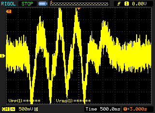

## Setup 2

Same setup as above, but this time using an 18-inch cable made of Canare L-5CFB RG6 cable.

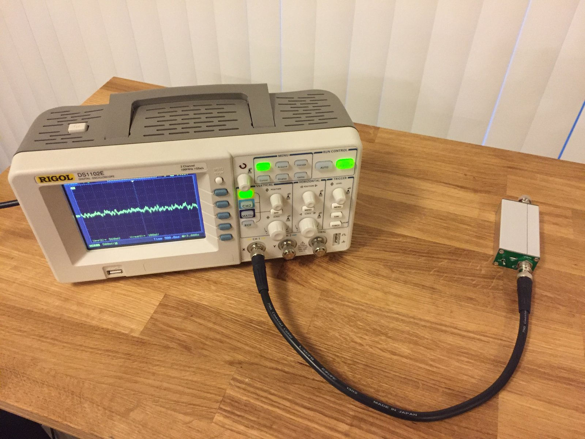

Noise floor:

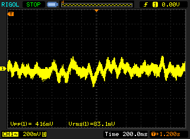

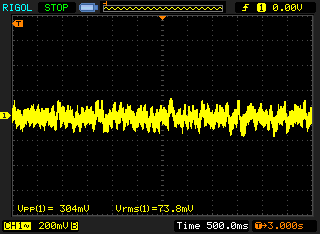

Arm-waving:

This is a step in the right direction, but it looks like we need to shield the LNA itself.

## Setup 3

The LNA is placed inside of an DIY faraday cage (an aluminum dutch oven which has been fitted with a BNC jack).
The scope is connected to the faraday cage using the Jameco RG58 cable.

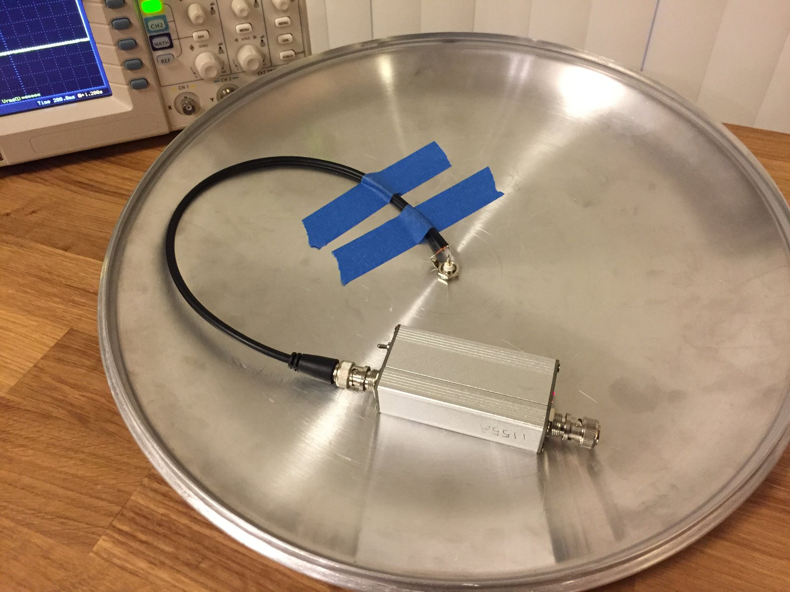

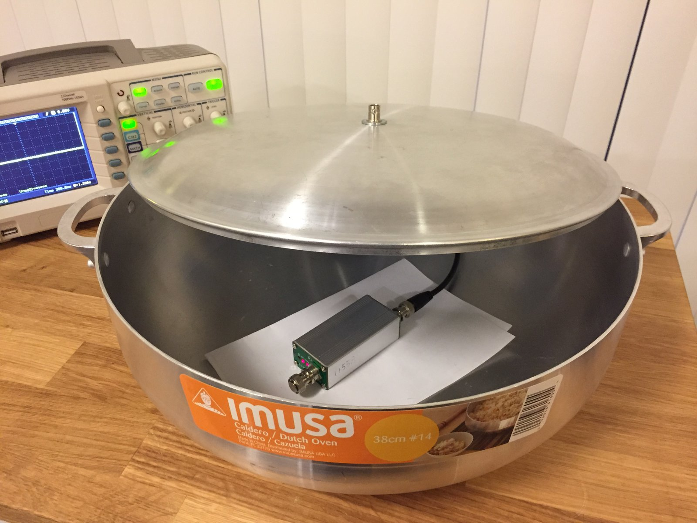

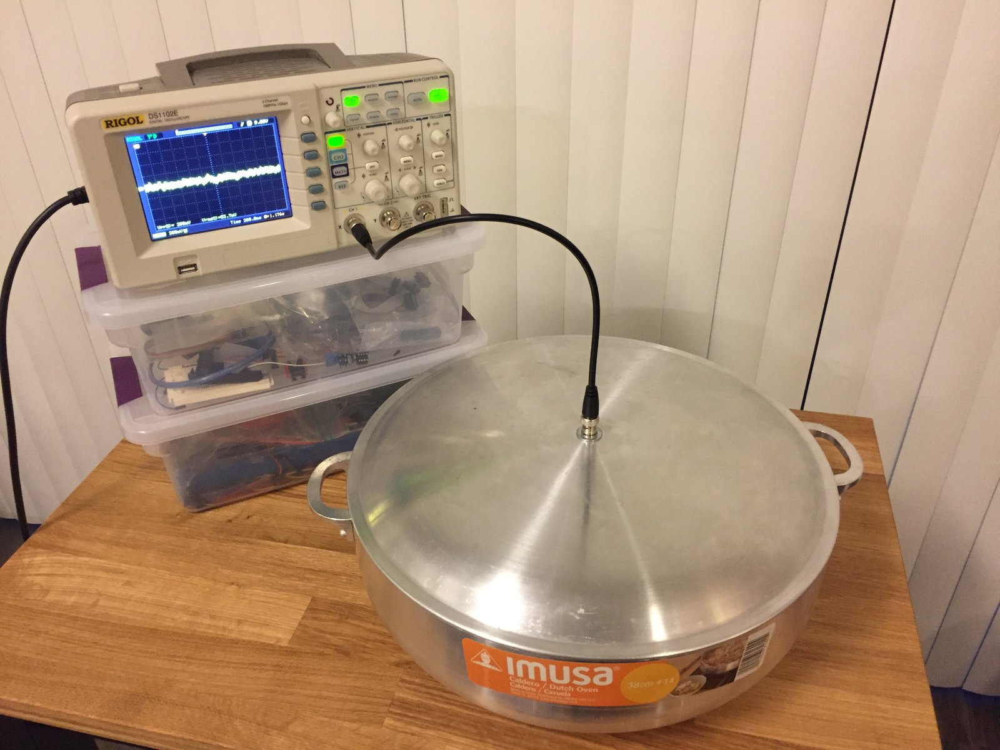

Noise floor:

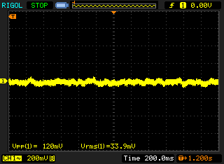

This is a much better result, and the system is no longer sensitive to arm-waving.

## Setup 4

Same setup as above, but the faraday cage is connected to the scope using the Canare L-5CFB RG6 cable.

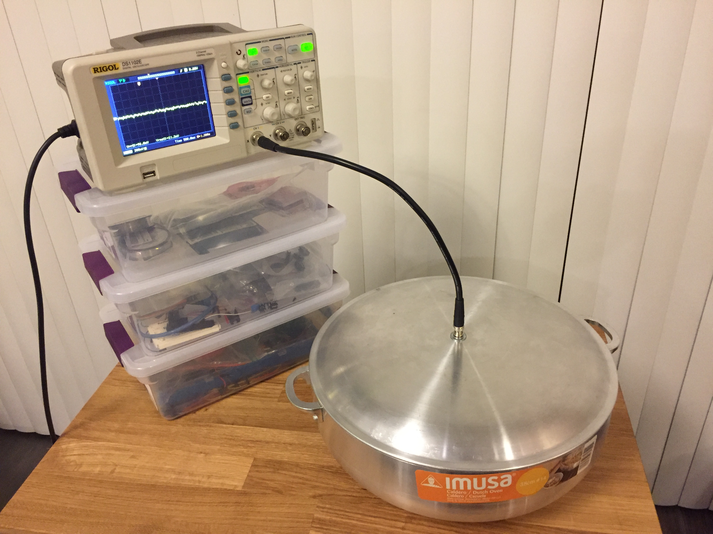

Noise floor:

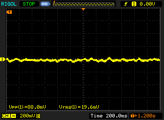

96nV p-p, 22.6nV RMS.  This roughly lines up with what others on the forum are seeing (~100nV noise floor).

This is the setup we will use for the rest of the measurements.

## Setup 5

Same as above, with an unpowered LTZ1000 connected to the LNA.

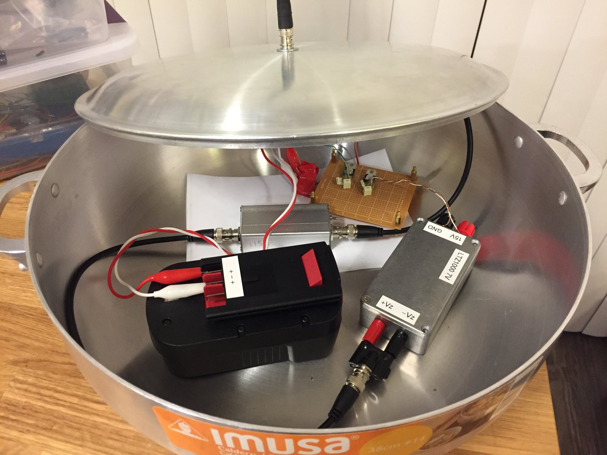

Noise floor:

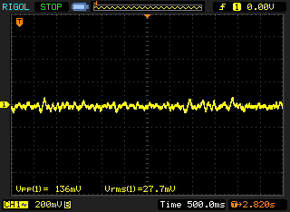

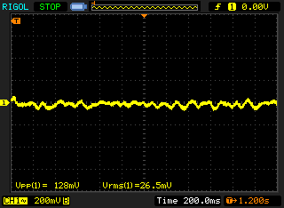

A bit of additional noise, even though the LTZ isn't powered up yet.

## Setup 6:

The LTZ1000 is powered up and it's 1/F noise is measured.

LTZ1000 #3:
- LTZ1000ACH
- date code 1101
- source: ebay (hifi-szjxic)
- socketed

60 seconds (5 seconds per division):
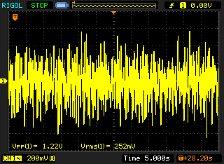

24 seconds (2 seconds per division):
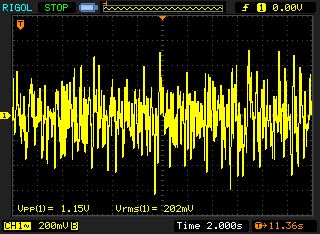

6 seconds (500ms per division):
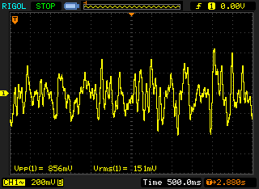

2.4 seconds (200ms per division):
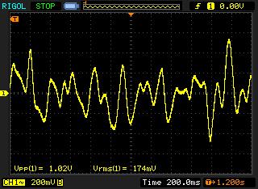

## Setup 7:

The socketed LTZ1000 is replaced with a different LTZ1000.

LTZ1000 #2:
- LTZ1000ACH
- date code 0415
- source: ebay (hifi-szjxic)
- socketed

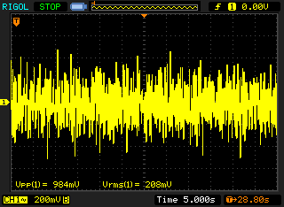

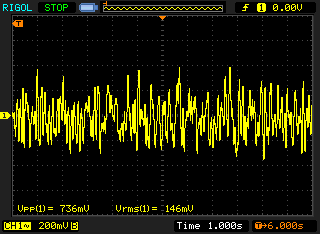

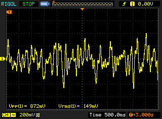

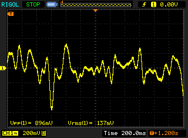

## Setup 8: LTZ1000 #11

LTZ1000 #11:
- LTZ1000ACH
- date code 9811
- source: taobao (Shantou Hua Yang Electronics)
- socketed

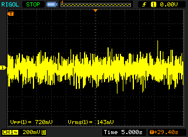

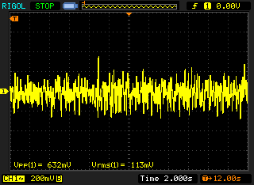

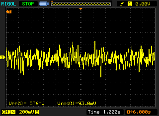

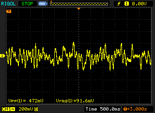

This LTZ seems particularly quiet.

## Setup 9:

LTZ1000 #5:
- LTZ1000ACH
- date code / marking: 1747 (1 dot)
- source: digikey
- socketed

Here, the leads on the LTZ1000 (about 1 inch long) were left untrimmed (which makes it stick out of the socket).

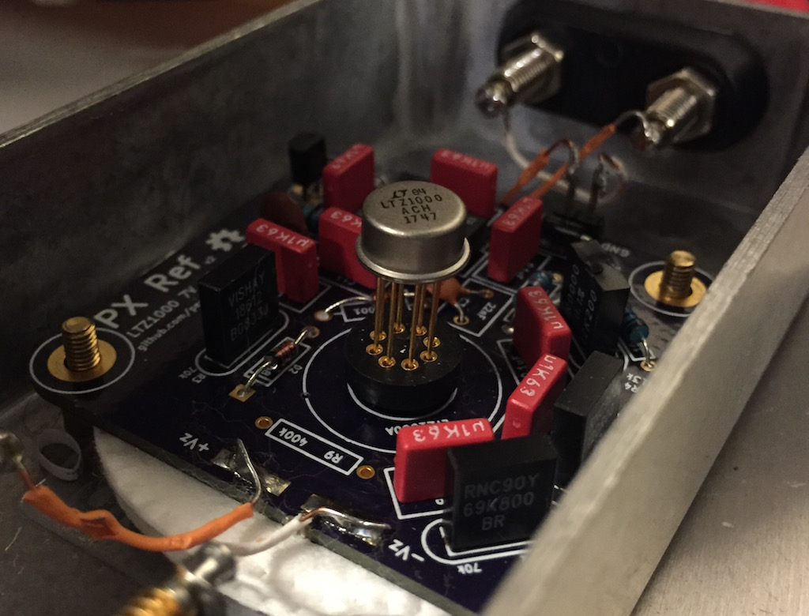

Results:

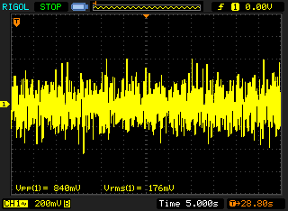

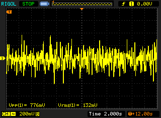

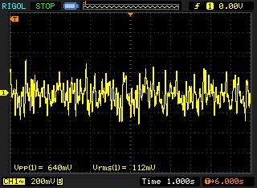

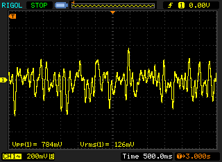

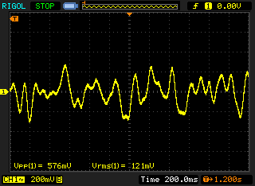

## Setup 10:

Same as above, but with trimmed leads such that the LTZ sits flush against the socket.

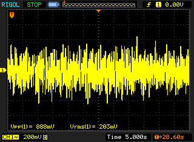

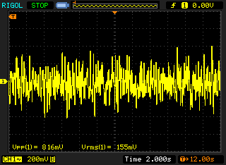

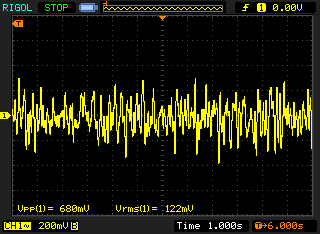

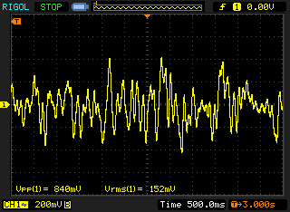

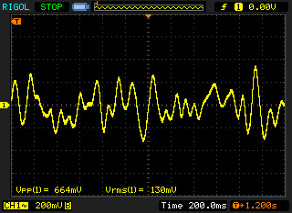

Surprisingly, the shorter leads seem to increase 1/F noise.  Is this the LTZ or is this the variability of my measurement setup?

I performed a few more 60-second runs to see what the repeatability was like.

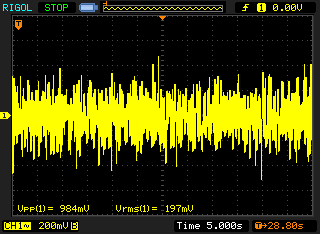
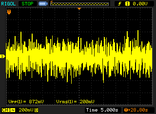
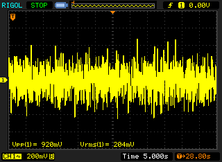
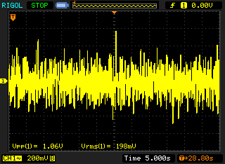
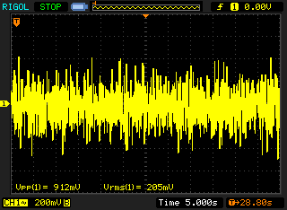
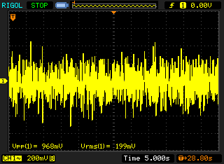
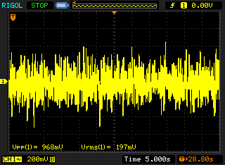
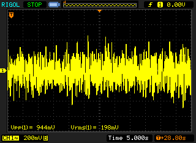
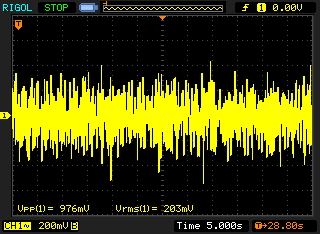

I will need to perform this test in further depth (with some of the other LTZ's) in the future.

## Setup 11:

LTZ1000 #6:
- LTZ1000ACH
- date code / marking: 1747 (2 dots)
- source: digikey
- socketed
- full-length leads

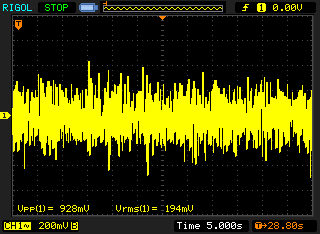

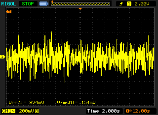

## Setup 12:

LTZ1000 #7:
- LTZ1000ACH
- date code / marking: 1747 (3 dots)
- source: digikey
- socketed
- full-length leads

## Setup 13:

LTZ1000 #8:
- LTZ1000ACH
- date code / marking: 1750 (1 dots)
- source: digikey
- socketed
- full-length leads

## Setup 14:

LTZ1000 #9:
- LTZ1000ACH
- date code / marking: 1750 (2 dots)
- source: digikey
- socketed
- full-length leads

## Setup 15:

LTZ1000 #10:
- LTZ1000ACH
- date code / marking: 1750 (3 dots)
- source: digikey
- socketed
- full-length leads

