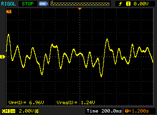
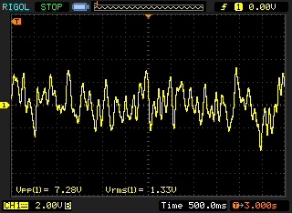
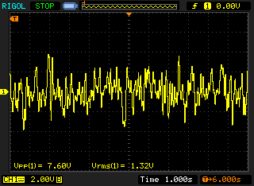
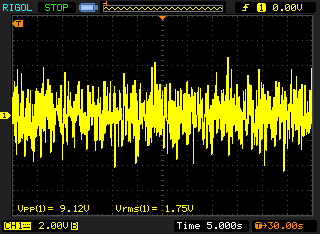

Some 1/f noise (0.1Hz to 10Hz) measurements of my EDC MV 106 using pipelie's LNA.

This LNA has a gain of 10,000, so I've configured my scope for a 100x probe,
which makes the units easier to deal with:
- 1V on the scope equals 1uV measured
- 100mV on scope equals 100nV measured

Results:

| Duration | Noise, p-p | Noise, RMS |
| --- | --- | --- |
| 2.4 seconds | 6.96uV | 1.24uV |
| 6 seconds | 7.28uV | 1.33uV |
| 12 seconds | 7.60uV | 1.32uV |
| 1 minute | 9.12uV | 1.75uV |
