When a Keithley 706 is set to "master" mode, this is what it sends out across the serial (coax) output when it first boots up.

These are sent about 4 seconds after power-on.

Group 1:

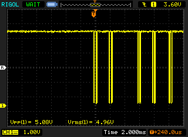

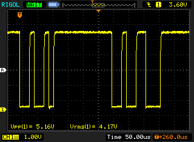

Group 2:

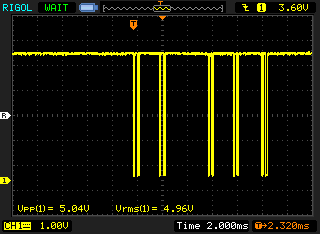

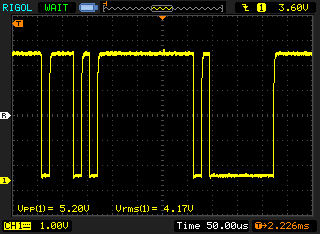

Group 3:

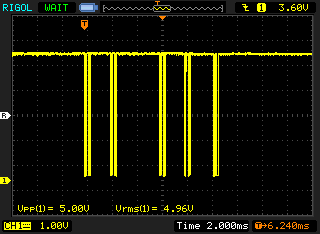

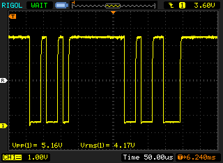

Group 4:

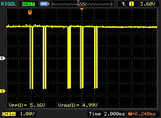

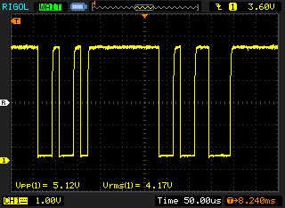

Group 5:

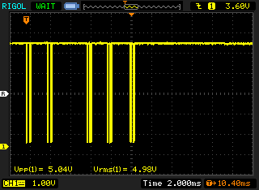

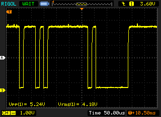

And this is sent out if you hit the "reset" button:

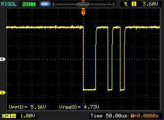
