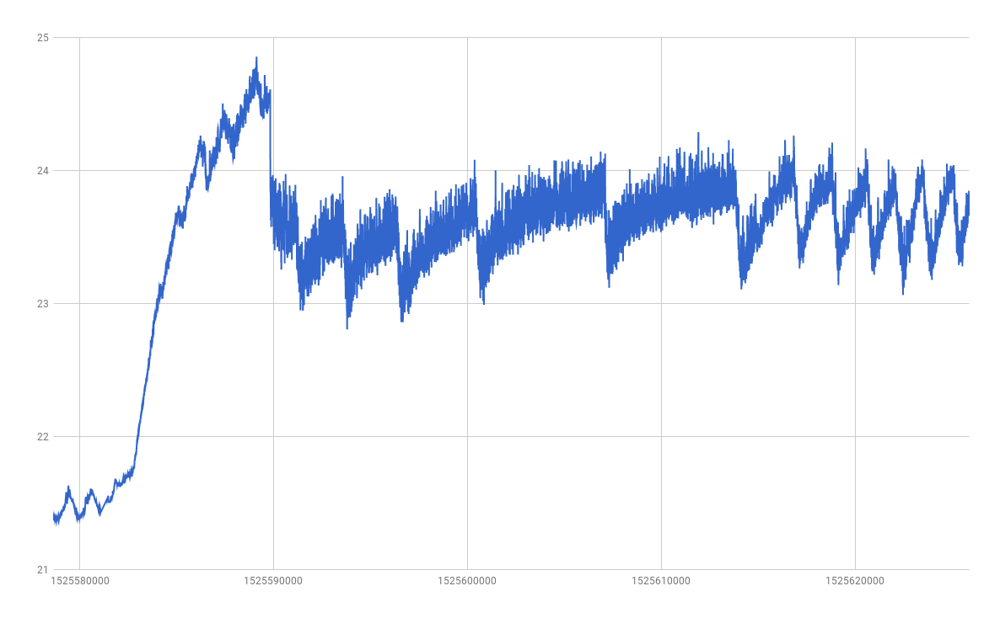
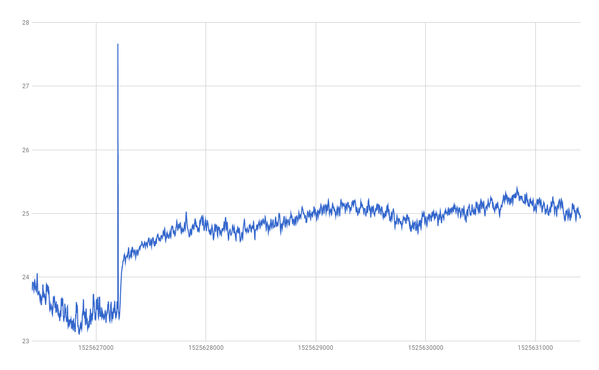
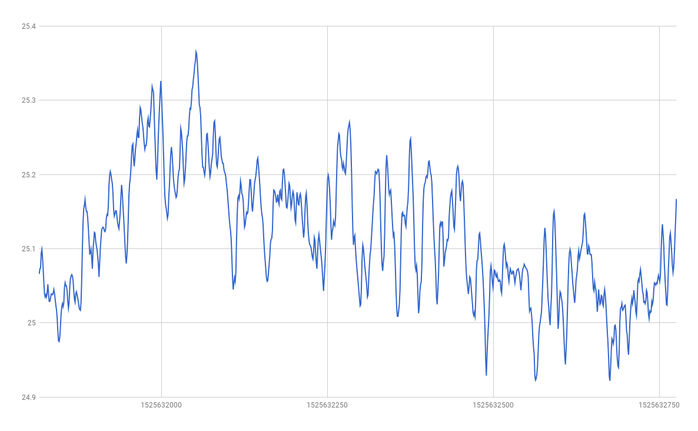
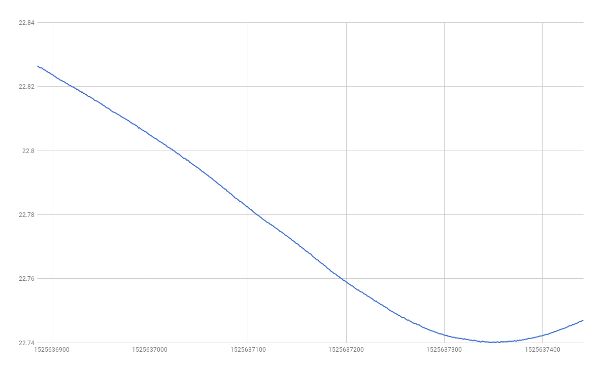
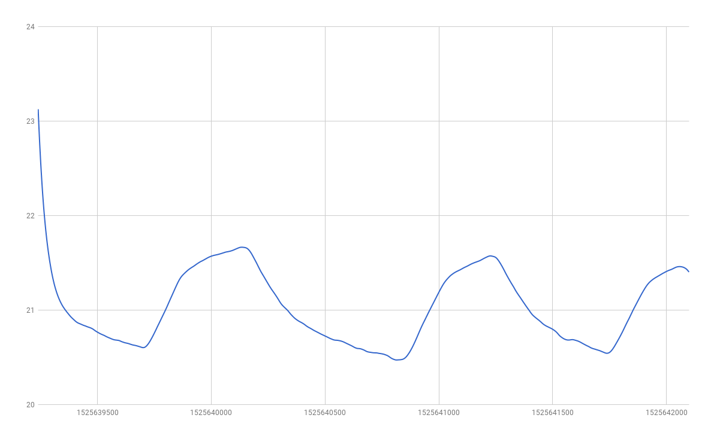

## run 1

started with meter turned off.

turned meter on, with fan at 20mA.

turned fan up to 100mA.

turned fan down to 60mA.

## run 2

unplugged the fan.

## run 3

removed the common-mode choke from the thermistor leads.

## run 4

removed the thermistor from the exhaust port, wrapped it in a dish towel, and laid it down in the bottom of the cardboard box.

whoa, the noise is down below 1mK.  let's repeat that with more resolution.

## run 5

repeated with more output resolution.

## run 6

bare thermistor dangling outside of box.

## run 7

thermistor wrapped in a cotton ball, dangling outside of box.

