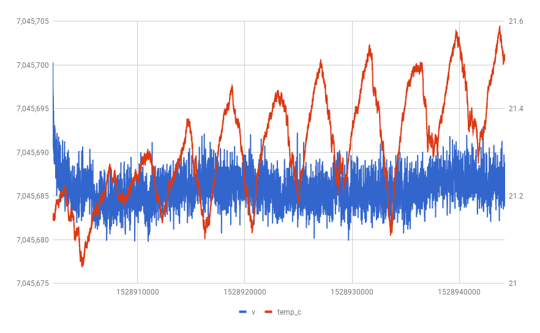
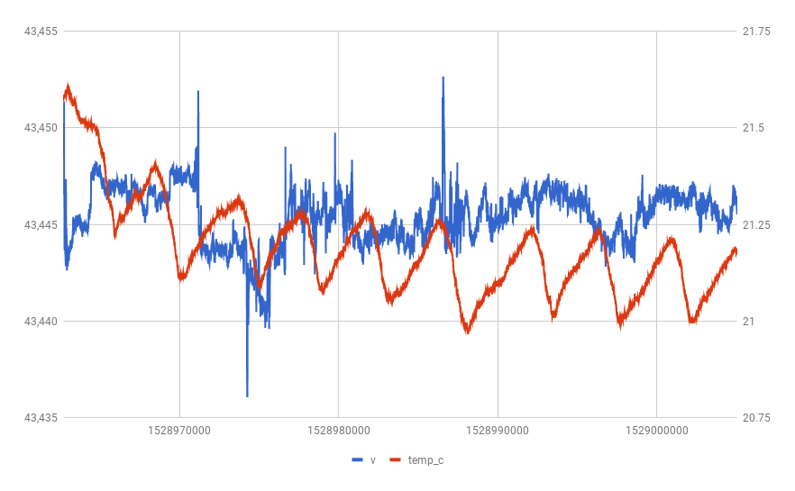
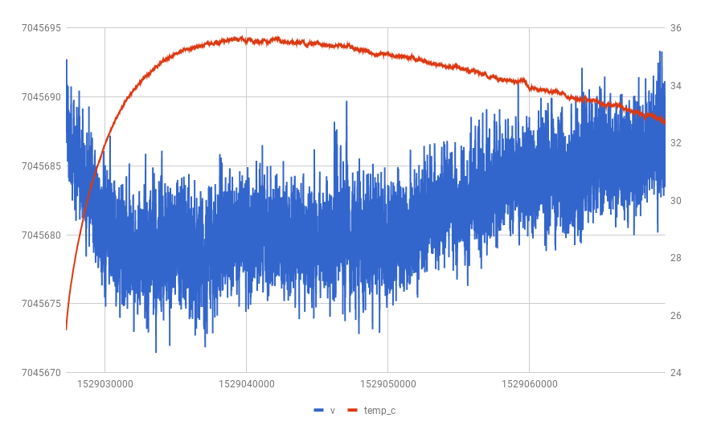
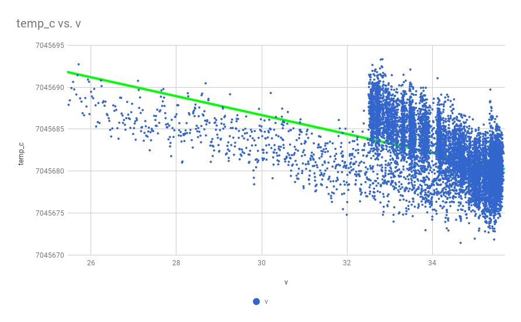
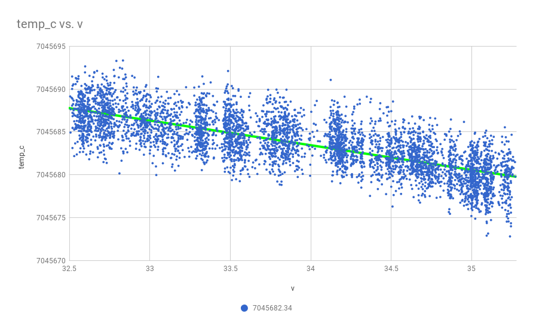

## run 1

Keithley 2015 with apartment thermostat set to 70F.

Running off of a linear supply, using the 7812.

## run 2

Keithley 2015 with apartment thermostat set to 70F.

Running off of NiMH drill battery, using the 7812.

oopsie, ran the battery down to nothing!

## run 3

Keithley 2015 with apartment thermostat set to 70F.

Running off of a linear supply, using the 7812.

## run 4

Keithley 2015 with apartment thermostat set to 70F.

px-ref back-to-back against my kx-ref.

both powered via (independent) linear supplies.

kx-ref is at 10v.

px-ref is 15v feeding the 7812.

kx-ref is positive lead, px-ref is negative lead.

## run 5

Keithley 2015 with apartment thermostat set to 70F.

Running off of NiMH drill battery, using the 7812.

In styrofoam ice chest with a tupperware container of hot water.

