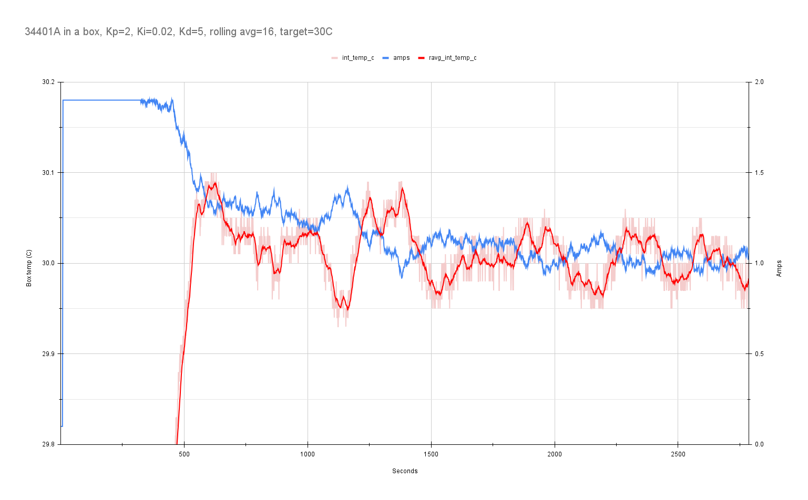
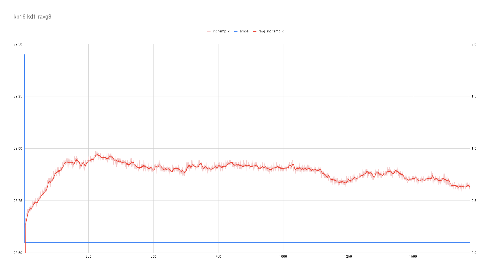

# HP 34401A in a box, PID tuning

## Kp=1

## Kp=2

## Kp=4 

## Kp=8

## Kp=4, Ki=0.1

## Kp=2, Ki=0.02

## Kp=1.6, Ki=0.019, Kd=80

## Kp=1.6, Ki=0.02, Kd=20, rolling-average=8

## log-9-pid-kp2-ki0_01-kd10-ravg16.csv

## log-10-pid-kp2-ki0_02-kd5-ravg16.csv

## log-10.2-pid-kp2-ki0_02-kd5-ravg16.csv

same settings, part 2

## log-11-pid-kp2-ki0_02-kd5-ravg16-cotton.csv

same settings, added a cotton ball around both sensors.

## log-11.2-pid-kp2-ki0_02-kd5-ravg16-cotton.csv

same, extended run

## log-12-pid-kp16-ravg8.csv

removed cotton, trying for pure Kp oscillation point.

also set tau to zero (aws 0.1)

## log-13-pid-kp32-ravg8.csv

## log-14-pid-kp64-ravg8.csv

## log-15-pid-kp16-kd1-ravg8.csv

## log-16-pid-kp16-kd1-ravg8-32c.csv

## log-17-pid-kp16-kd1-ravg8-32c-tau0.1.csv

## log-18-pid-kp16-kd2-ravg8-32c-tau0.1.csv

## log-19-pid-kp16-kd4-ravg8-32c-tau0.1.csv

## log-20-pid-kp16-kd8-ravg8-32c-tau0.1.csv

## Caveats

note: it appears that at some point the mosfet detached from the heatsink, so I'm not sure how much of the above results are tainted.
